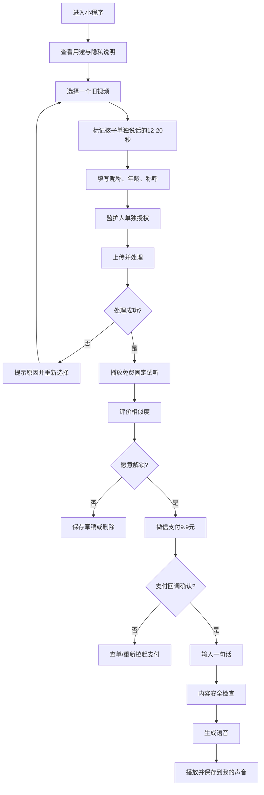
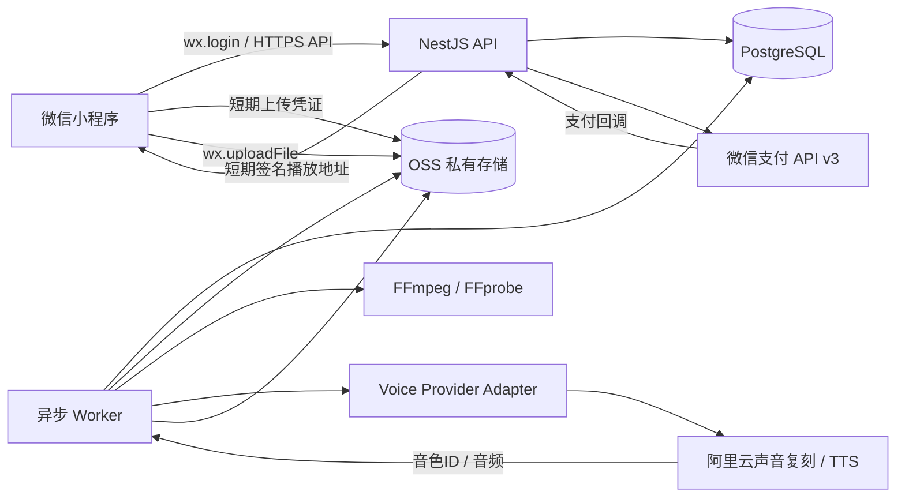
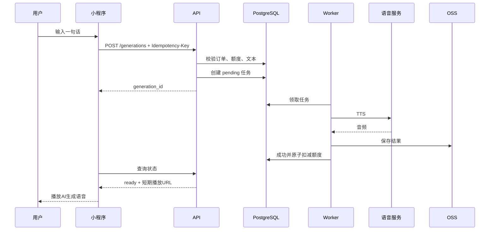

# 「那时的 TA」微信小程序 MVP 需求文档

> 工作名称：那时的 TA  
> 文档类型：产品需求文档（PRD）+ 技术实现方案 + 页面设计  
> 版本：v0.2  
> 日期：2026-08-21  
> 产品形态：微信小程序  
> MVP 售价：¥9.9 / 1 个孩子的 1 个年龄声音版本  
> 文档目标：以最小开发范围验证家长在听到“孩子小时候的声音说出一句新话”后，是否愿意真实付款。

---

## 1. 一句话定义

用户从手机相册选择一段孩子小时候的视频，手动截取一段只有孩子本人说话的声音，系统复刻该年龄的音色并免费生成一句试听；用户满意后支付 ¥9.9，可让“当时的声音”说 10 句自定义内容。

---

## 2. MVP 的核心判断

本 MVP **不是**为了验证“用户是否愿意长期和 AI 孩子聊天”，也不是为了构建完整的数字人格。

本轮只验证两个问题：

### H1：声音效果是否足以触发付费

当家长免费听到一段合格试听后，是否愿意支付 ¥9.9，解锁该年龄声音的自定义生成能力。

### H2：付费后是否存在真实使用，而不是只因好奇购买

付费用户是否会继续生成至少 3 句自定义语音，并愿意再次播放、收藏或分享小程序卡片。

### 建议的验证标准

| 指标 | 继续投入 | 需要优化 | 暂停扩展 |
|---|---:|---:|---:|
| 听完试听后的支付转化率 | ≥15% | 8%–14% | <8% |
| 付费用户生成 ≥3 句的比例 | ≥30% | 15%–29% | <15% |
| 试听“很像/比较像”占比 | ≥60% | 40%–59% | <40% |
| 首次处理成功率 | ≥70% | 50%–69% | <50% |
| 退款或严重投诉率 | <5% | 5%–10% | >10% |

> 以上是本项目内部 Go / No-Go 标准，不是行业统一标准。统计支付转化时，分母应当是“已经成功听到免费试听”的用户，而不是所有进入首页的用户。

---

## 3. 目标用户

### 3.1 第一目标用户

孩子目前已经 10–18 岁，手机中保存着孩子 2–8 岁视频的家长。

典型特征：

- 孩子现在的声音与小时候差异明显；
- 相册中有较多家庭视频；
- 会因孩子成长产生明显怀旧感；
- 愿意为低价亲子影像或情绪产品尝试付费；
- 能独立完成微信支付和视频选择。

### 3.2 第二目标用户

孩子已经成年、但家庭仍保存数字视频的父母。

### 3.3 暂不服务的人群

- 未满 18 周岁的创建者；
- 不能证明自己是监护人或已获得监护人授权的人；
- 上传明星、同学、陌生儿童、网络视频中的声音；
- 想把复刻声音用于电话、广告、商业配音、身份冒充或公开音色库的人；
- 需要自动扫描全部相册、自动识别孩子和自动按年龄分类的人。

---

## 4. 产品定位与表达

### 4.1 对外表达

主标题：

> **再听一次，TA 小时候的声音。**

副标题：

> 选一段旧视频，让当年的声音说一句新话。

### 4.2 不使用的表达

MVP 页面、广告和分享文案中不使用：

- AI 复活；
- 数字孩子；
- TA 真的回来了；
- 永生；
- 真人在线；
- 孩子本人正在回答；
- 永久拥有声音模型。

### 4.3 产品真实性边界

所有试听和自定义语音都必须明确标注：

> **AI 生成语音，不是孩子本人真实说过的话。**

产品只复刻声音特征，不声称复刻孩子的真实记忆、思想或人格。

---

## 5. MVP 范围

## 5.1 本期必须完成

1. 微信授权登录；
2. 从手机相册选择 1 个旧视频；
3. 用户手动标记声音片段的开始和结束时间；
4. 用户确认片段中只有目标孩子清楚说话；
5. 填写孩子昵称、视频中的年龄、孩子如何称呼创建者；
6. 监护人和敏感个人信息单独授权；
7. 后端提取 12–20 秒音频；
8. 基础音频质量检查；
9. 创建 1 个私有声音版本；
10. 免费生成 1 句固定试听；
11. 用户对相似度进行反馈；
12. 微信支付 ¥9.9；
13. 支付成功后输入自定义文字并生成语音；
14. 一个付费版本共 10 次成功生成额度；
15. 在小程序内播放和保存生成记录；
16. 分享小程序卡片，不分享原始音频文件；
17. 用户可一键删除项目、原始样本、声音模型和生成记录；
18. 完整埋点、支付回调幂等和异常恢复。

## 5.2 本期明确不做

- 自动扫描整个手机相册；
- 自动识别视频中的孩子；
- 说话人分离；
- 多人重叠语音处理；
- 强降噪和复杂语音修复；
- 同一个孩子的多个年龄版本；
- 多个孩子；
- 开放式 AI 对话；
- 语音输入；
- 长期记忆；
- 人格问卷；
- 聊天记录；
- 照片说话；
- 数字人或视频通话；
- 原始 MP3/WAV 下载；
- 公开音色分享；
- 月度会员；
- 无限生成；
- 自动续费；
- App；
- Web 端；
- 后台运营 CMS；MVP 可先通过数据库或简单内部脚本处理异常订单。

---

## 6. 商品与价格设计

### 6.1 免费部分

用户免费获得：

- 选择并截取 1 段旧视频；
- 创建 1 次声音试听；
- 固定试听句 1 句；
- 试听和相似度评价；
- 若效果不满意，可免费更换片段重试 1 次。

固定试听句：

```text
{{孩子对创建者的称呼}}，我是{{孩子昵称}}呀。
```

示例：

```text
妈妈，我是小雨呀。
```

### 6.2 ¥9.9 付费内容

一个订单包含：

- 1 个孩子；
- 1 个年龄声音版本；
- 10 次成功的自定义文字转语音；
- 每句最多 50 个中文字符；
- 生成结果保存在“我的声音”中；
- 可反复播放；
- 可分享小程序卡片；
- 不自动续费；
- 不包含开放式 AI 聊天；
- 不提供声音模型或原始音频导出。

### 6.3 次数扣减规则

- 只有生成成功并保存结果后才扣减 1 次；
- 服务端失败、内容审核误拦截、网络断开不扣次数；
- 同一个请求重复提交只生成一次，依赖幂等键；
- 用户删除一条已生成语音不返还次数；
- 若付款后没有任何一次成功生成且声音模型永久不可用，应支持退款。

---

## 7. 最小用户流程



### 最短完成路径

```text
首页
→ 选择视频
→ 设置开始和结束
→ 填 3 个字段并授权
→ 免费试听
→ ¥9.9
→ 输入一句话
→ 播放结果
```

---

## 8. 页面信息架构

```text
pages/
├── home/index                  首页
├── project/select-video        选择视频
├── project/select-clip         选择声音片段
├── project/profile-consent     基础信息与授权
├── project/processing          处理进度
├── project/preview             免费试听与付费
├── project/studio              自定义语音工作台
├── me/projects                 我的声音
└── me/privacy                  数据与隐私管理
```

底部不设置常驻 TabBar。MVP 只在首页右上角提供“我的声音”，减少导航复杂度。

---

# 9. 页面设计

## 9.1 全局视觉原则

### 气质

- 温暖、克制、真实；
- 不做儿童玩具风；
- 不做悲伤纪念风；
- 不做科幻数字人风；
- 不使用“在线状态”“正在思考”等拟人欺骗元素。

### 建议色彩

| 用途 | 色值 |
|---|---|
| 页面背景 | `#FFF9F5` |
| 卡片背景 | `#FFFFFF` |
| 主文字 | `#2B2725` |
| 次文字 | `#756D68` |
| 主按钮 | `#FF7256` |
| 辅助渐变 | `#FFF0E7 → #F4EEFF` |
| 成功状态 | `#2F8F62` |
| 风险提示 | `#C24E3D` |
| 分割线 | `#EEE7E2` |

### 尺寸

- 页面左右边距：20px；
- 主按钮高度：52px；
- 卡片圆角：16px；
- 输入框圆角：12px；
- 标题：28px / 700；
- 页面小标题：20px / 600；
- 正文：16px / 400；
- 辅助文字：13px / 400；
- 触控区域最小高度：44px。

---

## 9.2 P0：首页

### 页面目标

让用户在 5 秒内理解“旧视频 → 当年的声音 → 一句新话”，并愿意选择视频。

### 页面线框

```text
┌────────────────────────────┐
│                       我的声音 │
│                            │
│      [一张温暖的旧视频缩略图]  │
│                            │
│  再听一次，TA小时候的声音。     │
│                            │
│  选一段旧视频，让当年的声音      │
│  说一句新话。                  │
│                            │
│  [ 选择一个旧视频 ]            │
│                            │
│  ✓ 原视频处理后自动删除          │
│  ✓ 不进入公共音色库              │
│  ✓ 可随时删除全部数据            │
│                            │
│  AI生成语音，不是本人真实表述     │
└────────────────────────────┘
```

### 主要组件

- 情绪示意图或轻量视频卡；
- 主标题；
- 一句话解释；
- 主 CTA；
- 三条信任说明；
- AI 标识说明；
- 《隐私政策》《儿童个人信息保护规则》《服务协议》入口。

### 埋点

- `home_view`
- `home_choose_video_click`
- `home_my_projects_click`
- `home_privacy_click`

---

## 9.3 P1：选择视频

### 页面目标

指导用户主动选择一个容易成功的视频，避免后端处理复杂语音。

### 页面线框

```text
┌────────────────────────────┐
│ ‹ 选择旧视频                  │
│                            │
│  请选择这样的片段：             │
│                            │
│  ✓ 孩子单独说话                │
│  ✓ 声音清楚                    │
│  ✓ 没有电视或音乐声             │
│  ✓ 视频不超过60秒              │
│                            │
│  [ 从相册选择视频 ]             │
│                            │
│  本次只会处理你主动选择的视频。   │
└────────────────────────────┘
```

### 前端校验

- 仅允许 `video`；
- 视频时长必须在 12–60 秒；
- 文件大小建议不超过 100MB；
- 不能一次选择多个视频；
- 不访问或扫描用户其他相册内容。

### 错误提示

| 情况 | 提示 |
|---|---|
| 视频不足 12 秒 | 请选择至少 12 秒的视频 |
| 视频超过 60 秒 | MVP 暂只支持 60 秒以内的视频 |
| 文件过大 | 请先在相册中裁短后再试 |
| 用户取消 | 保持当前页面，不弹错误 |
| 无相册权限 | 引导用户到系统设置开启权限 |

---

## 9.4 P2：选择声音片段

### 页面目标

由用户承担“找到孩子单独说话片段”的判断，MVP 不做说话人识别。

### 交互方式

不实现复杂的双端拖拽时间轴。采用更容易开发和理解的方案：

1. 播放视频；
2. 播放到合适位置，点击“设为开始”；
3. 播放到结束位置，点击“设为结束”；
4. 点击“试听所选片段”；
5. 确认。

### 页面线框

```text
┌────────────────────────────┐
│ ‹ 选择孩子说话的片段          │
│                            │
│ ┌────────────────────────┐ │
│ │                        │ │
│ │       视频播放器         │ │
│ │                        │ │
│ └────────────────────────┘ │
│             当前 00:16       │
│                            │
│ [设为开始]       [设为结束]    │
│                            │
│ 已选择：00:12 — 00:29         │
│ 时长：17秒                    │
│                            │
│ [ ▶ 试听所选片段 ]             │
│                            │
│ □ 我确认这段只有孩子本人清楚说话 │
│   没有其他人同时讲话            │
│                            │
│ [ 使用这段声音 ]                │
└────────────────────────────┘
```

### 业务规则

- 最短 12 秒；
- 最长 20 秒，允许用户最多选择 30 秒，但后端只提取质量最高或前 20 秒；
- 开始时间必须早于结束时间；
- 未勾选“单人声音确认”不能继续；
- 页面上明确提示：如果有多人讲话，请换一个片段，不进行自动分离。

### 埋点

- `clip_start_marked`
- `clip_end_marked`
- `clip_preview_played`
- `clip_single_speaker_confirmed`
- `clip_confirmed`

---

## 9.5 P3：孩子信息与授权

### 页面目标

收集生成试听所需的最少信息，并取得处理儿童声纹所需的单独授权。

### 页面线框

```text
┌────────────────────────────┐
│ ‹ 补充一点信息               │
│                            │
│ TA当时叫什么？                │
│ [ 小雨                    ]   │
│                            │
│ 视频里的TA几岁？               │
│ [ 5岁                     ]   │
│                            │
│ TA当时怎么叫你？               │
│ [ 妈妈                    ]   │
│                            │
│ 使用与授权                    │
│ □ 我已满18周岁                 │
│ □ 我是孩子的监护人，或已获得     │
│   监护人的明确授权              │
│ □ 我同意仅为本次私密家庭体验处理  │
│   所选视频、声音与声纹信息        │
│ □ 我知道生成内容是AI合成，不是    │
│   孩子本人真实说过的话            │
│                            │
│ [ 开始生成免费试听 ]             │
└────────────────────────────┘
```

### 字段规则

| 字段 | 必填 | 限制 |
|---|---:|---|
| 孩子昵称 | 是 | 1–10 个字符，不允许电话、网址 |
| 视频中年龄 | 是 | 1–18 岁 |
| 对创建者的称呼 | 是 | 1–8 个字符 |
| 创建者满 18 岁 | 是 | 单独确认 |
| 监护人资格或授权 | 是 | 单独确认 |
| 敏感信息处理同意 | 是 | 单独确认并记录版本 |
| AI 生成认知 | 是 | 单独确认 |

### 授权记录

服务端必须保存：

- 用户 ID；
- 项目 ID；
- 协议版本；
- 授权文本摘要哈希；
- 勾选时间；
- IP；
- User-Agent；
- 微信小程序版本；
- 是否监护人；
- 是否同意处理声纹；
- 是否同意委托云服务商处理；
- 撤回时间。

---

## 9.6 P4：处理进度

### 页面目标

让用户知道系统在做什么，但不假装孩子“正在思考”。

### 页面线框

```text
┌────────────────────────────┐
│                            │
│        [声音波形动效]          │
│                            │
│  正在制作“小雨 · 5岁”的声音版本 │
│                            │
│  ✓ 已收到视频                  │
│  ✓ 正在提取所选片段             │
│  ○ 检查声音质量                │
│  ○ 创建私有声音版本             │
│  ○ 生成免费试听                │
│                            │
│  请保持小程序开启，离开后也可在    │
│  “我的声音”中查看结果            │
│                            │
│  AI生成语音，不是本人真实表述      │
└────────────────────────────┘
```

### 状态

```text
UPLOADING
→ EXTRACTING
→ QUALITY_CHECKING
→ ENROLLING
→ PREVIEW_GENERATING
→ PREVIEW_READY
```

### 失败处理

| 错误 | 用户提示 | 操作 |
|---|---|---|
| 无有效人声 | 没听到足够清楚的人声 | 重新选择 |
| 音量过低 | 这段声音太小，复刻效果可能不好 | 重新选择 |
| 静音过多 | 孩子真正说话的时间不足 | 重新截取 |
| 服务商拒绝音色 | 这段声音暂时无法创建 | 免费换片段 |
| 网络中断 | 任务仍在后台处理 | 去我的声音 |
| 内部失败 | 本次没有产生费用 | 重试或联系客服 |

---

## 9.7 P5：免费试听与付费

### 页面目标

先完成 Aha Moment，再展示价格。

### 页面线框

```text
┌────────────────────────────┐
│ ‹ 小雨 · 5岁                 │
│                            │
│       免费试听已生成           │
│                            │
│ ┌────────────────────────┐ │
│ │ ▶  00:04               │ │
│ │ “妈妈，我是小雨呀。”     │ │
│ │ AI生成语音               │ │
│ └────────────────────────┘ │
│                            │
│ 听起来像TA当时的声音吗？       │
│ [很像] [有一点像] [不像]       │
│                            │
│  ¥9.9 解锁这个年龄的声音        │
│  · 可输入10句话               │
│  · 生成结果保存在我的声音       │
│  · 不自动续费                 │
│                            │
│ [ ¥9.9 解锁 ]                 │
│                            │
│ 不够像？[免费换一段视频重试]     │
└────────────────────────────┘
```

### 支付原则

- 用户至少完整播放一次试听后才高亮付款按钮；
- 相似度选择“ 不像 ”时，默认突出“免费换片段”，不强推支付；
- 支付解锁信息必须列明“10 句”“1 个年龄版本”“不自动续费”；
- 客户端支付成功不等于订单成功；
- 只有服务端收到并验证微信支付回调后才解锁额度；
- 支付状态不确定时主动查单。

### 埋点

- `preview_ready`
- `preview_play_start`
- `preview_play_complete`
- `preview_similarity_vote`
- `paywall_view`
- `pay_click`
- `payment_success`
- `payment_fail`
- `retry_clip_click`

---

## 9.8 P6：自定义语音工作台

### 页面目标

让用户以最简单的方式输入一句话并播放生成结果。

### 页面线框

```text
┌────────────────────────────┐
│ ‹ 小雨 · 5岁        剩余 10次 │
│                            │
│ 想让当时的声音说什么？          │
│ ┌────────────────────────┐ │
│ │ 妈妈，我最喜欢你啦。       │ │
│ │                    11/50 │ │
│ └────────────────────────┘ │
│                            │
│ 提醒：不要输入验证码、转账、广告、 │
│ 冒充身份或伤害他人的内容。        │
│                            │
│ [ 生成声音 ]                  │
│                            │
│ 最近生成                     │
│ ┌────────────────────────┐ │
│ │ ▶ 妈妈，我最喜欢你啦。     │ │
│ │ AI生成语音 · 00:04       │ │
│ └────────────────────────┘ │
│                            │
│ [ 分享小程序卡片 ]             │
└────────────────────────────┘
```

### 规则

- 输入 1–50 个中文字符；
- 不支持空文本；
- 不允许网址、二维码内容、连续长数字、验证码、银行卡、转账、营销叫卖、身份核验等高风险文本；
- 生成前进行本地硬规则和服务端内容安全检测；
- 输出播放器旁持续显示“AI 生成语音”；
- MVP 不提供情绪、语速、语气风格调节；
- 不提供“让 AI 自动回复”；
- 不展示或返回供应商的 `voice_id`；
- 不允许第三方 API 调用该声音。

---

## 9.9 P7：我的声音

### 页面线框

```text
┌────────────────────────────┐
│ 我的声音                     │
│                            │
│ ┌────────────────────────┐ │
│ │ 小雨 · 5岁              │ │
│ │ 已生成 4 句 · 剩余 6 次   │ │
│ │ [继续生成]    [查看]      │ │
│ └────────────────────────┘ │
│                            │
│ 草稿                         │
│ ┌────────────────────────┐ │
│ │ 小雨 · 3岁              │ │
│ │ 免费试听尚未完成          │ │
│ │ [继续]        [删除]      │ │
│ └────────────────────────┘ │
│                            │
│ [数据与隐私管理]              │
└────────────────────────────┘
```

### 功能

- 查看项目；
- 继续处理；
- 继续生成；
- 查看剩余次数；
- 删除项目；
- 进入数据与隐私管理；
- 订单和退款入口；
- 客服入口。

---

## 9.10 P8：数据与隐私管理

必须提供：

- 查看本项目收集了哪些数据；
- 删除原视频；
- 删除声音样本；
- 删除声音模型；
- 删除生成结果；
- 删除整个项目；
- 撤回敏感信息处理同意；
- 注销账号；
- 联系个人信息保护负责人或客服；
- 查看数据保存规则。

删除项目时二次确认：

```text
删除后将无法恢复：
· 所选视频与声音片段
· 私有声音版本
· 已生成语音
· 未使用的生成次数

订单记录将按法律和财务要求保留。
```

---

# 10. 技术实现方案

## 10.1 总体原则

1. 一套 TypeScript 代码栈优先；
2. 一个 API 服务和一个异步 Worker；
3. PostgreSQL 同时承担业务数据和轻量任务队列，MVP 不引入 Redis；
4. 视频和声音全部存储在中国境内的私有对象存储；
5. 原视频只短期存在；
6. 声音服务通过 Provider Adapter 隔离，避免绑定单一供应商；
7. 所有生成、支付、删除操作必须幂等；
8. 不在小程序端保存云服务密钥；
9. 不在日志中记录音频 URL、原始文本以外的敏感内容；
10. 先做非实时 TTS，不做 WebSocket 实时对话。

---

## 10.2 推荐技术栈

### 小程序

- 微信小程序原生框架；
- TypeScript；
- WXML / WXSS；
- 轻量组件库可选 TDesign Miniprogram；
- `wx.login`：登录；
- `wx.chooseMedia`：选择视频；
- `<video>` + `VideoContext`：播放和定位；
- `wx.uploadFile`：上传；
- `InnerAudioContext`：播放生成音频；
- `wx.requestPayment`：支付。

选择原生小程序而不是跨端框架的原因：

- MVP 只有微信端；
- 媒体、支付和文件上传是核心；
- 原生 API 路径最短；
- 降低真机兼容问题；
- 包体积更小。

### 服务端

- Node.js；
- NestJS；
- TypeScript；
- PostgreSQL；
- Prisma 或 Drizzle ORM，二选一；
- OpenAPI / Swagger；
- Docker；
- FFmpeg / FFprobe；
- PostgreSQL 任务表或 pg-boss；
- 阿里云 OSS 私有 Bucket；
- 阿里云百炼声音复刻和语音合成；
- 微信支付 API v3；
- Sentry 或同类错误监控；
- OpenTelemetry 可在公开测试后再加入。

### 部署

MVP 建议使用：

```text
阿里云中国大陆地域
├── 1 个 API 容器
├── 1 个 Worker 容器
├── RDS PostgreSQL
├── OSS 私有 Bucket
├── 日志服务
└── 百炼语音服务
```

API 与 Worker 可由同一个代码仓库、同一个 Docker 镜像，通过不同启动命令运行。

---

## 10.3 架构图



---

## 10.4 为什么不用自动说话人识别

MVP 通过产品约束替代算法：

```text
算法方案：
多人分离 → 聚类 → 目标说话人识别 → 重叠语音处理
难度高、效果不稳定、无法直接验证付费假设

MVP方案：
用户自己选孩子单独说话的片段
```

因此本期不引入：

- pyannote；
- speaker diarization；
- source separation；
- target speaker verification；
- 全相册人脸或声纹搜索。

---

## 10.5 上传流程

### 流程

1. 小程序本地选择视频；
2. 本地读取时长和大小；
3. 用户在本地视频播放器中设置起止时间；
4. 用户确认授权；
5. 小程序向 API 请求 OSS 短期上传凭证；
6. 小程序直接上传到私有 OSS；
7. 上传成功后将 `object_key`、`start_ms`、`end_ms` 提交给 API；
8. API 创建处理任务；
9. Worker 读取对象并处理；
10. 音频片段成功后，原视频进入自动删除队列。

### 文件限制

| 项目 | 限制 |
|---|---:|
| 视频数量 | 1 |
| 视频时长 | 12–60 秒 |
| 文件大小 | ≤100MB |
| 片段时长 | 12–20 秒为推荐，最大 30 秒 |
| 视频格式 | 以微信选择器返回格式为准，服务端统一解码 |
| 音频输出 | WAV, PCM S16LE, 单声道, 24kHz |

### 对象存储路径

```text
private/
  users/{user_id}/
    projects/{project_id}/
      source/{asset_id}.mp4
      samples/{sample_id}.wav
      previews/{generation_id}.mp3
      outputs/{generation_id}.mp3
```

路径中不使用孩子姓名、年龄或 openid。

---

## 10.6 FFmpeg 音频提取

### 推荐命令

```bash
ffmpeg \
  -hide_banner \
  -nostdin \
  -i input.mp4 \
  -ss 12.400 \
  -t 17.000 \
  -vn \
  -ac 1 \
  -ar 24000 \
  -c:a pcm_s16le \
  output.wav
```

说明：

- 短视频场景将 `-ss` 放在输入之后，优先保证裁剪精度；
- 不做激进降噪；
- 保留一份原始裁剪音频；
- 若音量偏低，只生成一份轻度归一化副本给声音服务；
- 不覆盖原始样本。

### 基础质量检测

MVP 只检查：

| 检查项 | 建议阈值 |
|---|---:|
| 总片段时长 | 12–20 秒 |
| VAD 有效人声 | ≥8 秒 |
| 静音比例 | ≤40% |
| 平均音量 | 不低于约 -35 dBFS |
| 削波比例 | <1% |
| 采样率 | 统一到 24kHz |
| 可解码 | 必须通过 FFprobe |

实现方式：

- FFprobe：格式、时长、采样率；
- FFmpeg `silencedetect`：静音比例；
- FFmpeg `volumedetect`：音量；
- WebRTC VAD：有效人声时长；
- 不检测是不是儿童；
- 不检测是不是一个人；
- 单人声音由用户确认负责。

---

## 10.7 声音复刻 Provider Adapter

### 接口设计

```ts
export interface VoiceProvider {
  enrollVoice(input: {
    projectId: string;
    sampleUrl: string;
    language: 'zh';
    preprocess: boolean;
  }): Promise<{
    providerVoiceId: string;
    status: 'processing' | 'ready' | 'rejected';
  }>;

  getVoiceStatus(providerVoiceId: string): Promise<
    'processing' | 'ready' | 'rejected'
  >;

  synthesize(input: {
    providerVoiceId: string;
    text: string;
    requestId: string;
  }): Promise<{
    audio: Buffer;
    mimeType: 'audio/mpeg' | 'audio/wav';
    durationMs?: number;
  }>;

  deleteVoice(providerVoiceId: string): Promise<void>;
}
```

### 首选实现

首选：

- 声音注册：阿里云 `voice-enrollment`；
- 目标模型：`cosyvoice-v3.5-flash`；
- 输入：OSS 5 分钟内有效的签名 URL；
- 语言：`zh`；
- `max_prompt_audio_length`：20；
- `enable_preprocess`：
  - 高质量样本：`false`；
  - 存在轻微背景噪音：`true`；
- 创建后轮询音色状态；
- 只有状态为 `OK/ready` 才生成试听。

### 供应商接入前的强制阻断条件

必须在上线前向供应商确认：

1. 服务是否允许在取得监护人授权后处理未成年人声音；
2. 是否会将样本用于模型训练；
3. 是否支持关闭训练授权；
4. 数据保存位置和保存期限；
5. 删除音色接口是否会同步删除相关样本；
6. 是否存在儿童音色额外审核；
7. 商业使用和收费场景是否被允许。

未得到明确答复前，不进入公开测试。

---

## 10.8 试听生成

试听文本由服务端生成，客户端不能修改：

```ts
function buildPreviewText(nickname: string, callerName: string): string {
  return `${callerName}，我是${nickname}呀。`;
}
```

安全限制：

- 对昵称和称呼先做字符过滤；
- 试听文本最长 20 字；
- 试听只生成一次；
- 免费重试必须先删除旧声音版本，再创建新版本；
- 试听音频保存在私有 OSS；
- 返回给小程序的是短期签名播放地址。

---

## 10.9 自定义语音生成

### 请求流程



### 幂等设计

客户端每次生成随机创建：

```text
Idempotency-Key: UUIDv4
```

数据库建立唯一约束：

```text
UNIQUE(user_id, idempotency_key)
```

重复请求返回原任务，不再次生成，也不重复扣减。

### 额度扣减事务

```text
BEGIN
  锁定 voice_project
  确认 remaining_quota > 0
  更新 generation = SUCCEEDED
  remaining_quota = remaining_quota - 1
COMMIT
```

模型失败时：

```text
generation = FAILED
remaining_quota 不变
```

---

## 10.10 微信支付

### 流程

1. 服务端创建业务订单，金额固定为 990 分；
2. 服务端调用微信支付 JSAPI / 小程序下单；
3. 返回小程序调起支付所需参数；
4. 小程序调用 `wx.requestPayment`；
5. 微信支付异步通知服务端；
6. 服务端验证微信支付签名并解密回调；
7. 订单幂等更新为 `PAID`；
8. 项目额度设置为 10；
9. 客户端轮询订单状态；
10. 客户端支付回调只用于 UI 提示，不能直接解锁。

### 关键规则

- 金额只在服务端定义；
- 商品描述固定；
- `out_trade_no` 唯一；
- 回调验签；
- 回调重复到达必须幂等；
- 支付状态不确定时调用查单；
- 订单成功后不可因客户端关闭页面而丢失；
- 商户私钥和 API v3 Key 只存服务端密钥管理系统；
- 支持退款状态机。

---

## 10.11 数据模型

### `users`

| 字段 | 类型 | 说明 |
|---|---|---|
| id | UUID | 主键 |
| wechat_openid_hash | TEXT | openid 加密或哈希索引 |
| status | ENUM | ACTIVE / DELETED |
| created_at | TIMESTAMPTZ | 创建时间 |
| deleted_at | TIMESTAMPTZ | 注销时间 |

### `voice_projects`

| 字段 | 类型 | 说明 |
|---|---|---|
| id | UUID | 项目 ID |
| user_id | UUID | 用户 |
| nickname_ciphertext | TEXT | 加密后的昵称 |
| age_at_video | SMALLINT | 视频中年龄 |
| caller_name_ciphertext | TEXT | 称呼 |
| status | ENUM | 项目状态 |
| free_retry_count | SMALLINT | 免费重试次数 |
| total_quota | SMALLINT | 付费总次数 |
| remaining_quota | SMALLINT | 剩余次数 |
| paid_at | TIMESTAMPTZ | 付款时间 |
| created_at | TIMESTAMPTZ | 创建时间 |
| deleted_at | TIMESTAMPTZ | 删除时间 |

### `media_assets`

| 字段 | 类型 | 说明 |
|---|---|---|
| id | UUID | 资源 ID |
| project_id | UUID | 项目 |
| kind | ENUM | SOURCE_VIDEO / VOICE_SAMPLE / PREVIEW / OUTPUT |
| object_key | TEXT | OSS Key |
| mime_type | TEXT | MIME |
| size_bytes | BIGINT | 大小 |
| duration_ms | INT | 时长 |
| sha256 | TEXT | 完整性 |
| retention_until | TIMESTAMPTZ | 自动清理时间 |
| deleted_at | TIMESTAMPTZ | 删除时间 |

### `consent_records`

| 字段 | 类型 | 说明 |
|---|---|---|
| id | UUID | 主键 |
| user_id | UUID | 用户 |
| project_id | UUID | 项目 |
| consent_type | ENUM | ADULT / GUARDIAN / BIOMETRIC / PROCESSOR / AI_NOTICE |
| policy_version | TEXT | 协议版本 |
| text_hash | TEXT | 授权文本哈希 |
| granted_at | TIMESTAMPTZ | 同意时间 |
| revoked_at | TIMESTAMPTZ | 撤回时间 |
| ip_hash | TEXT | IP 去标识记录 |
| client_version | TEXT | 小程序版本 |

### `voice_models`

| 字段 | 类型 | 说明 |
|---|---|---|
| id | UUID | 主键 |
| project_id | UUID | 项目 |
| provider | TEXT | 供应商 |
| provider_voice_id_ciphertext | TEXT | 加密保存 |
| status | ENUM | PROCESSING / READY / REJECTED / DELETED |
| sample_asset_id | UUID | 样本 |
| created_at | TIMESTAMPTZ | 创建 |
| deleted_at | TIMESTAMPTZ | 删除 |

### `orders`

| 字段 | 类型 | 说明 |
|---|---|---|
| id | UUID | 主键 |
| user_id | UUID | 用户 |
| project_id | UUID | 项目 |
| out_trade_no | TEXT UNIQUE | 商户订单号 |
| amount_fen | INT | 固定 990 |
| status | ENUM | CREATED / PAYING / PAID / CLOSED / REFUNDING / REFUNDED |
| transaction_id | TEXT | 微信交易号 |
| paid_at | TIMESTAMPTZ | 支付时间 |
| created_at | TIMESTAMPTZ | 创建时间 |

### `generations`

| 字段 | 类型 | 说明 |
|---|---|---|
| id | UUID | 主键 |
| project_id | UUID | 项目 |
| user_id | UUID | 用户 |
| idempotency_key | UUID | 客户端幂等键 |
| kind | ENUM | PREVIEW / CUSTOM |
| text_ciphertext | TEXT | 加密保存 |
| status | ENUM | PENDING / PROCESSING / SUCCEEDED / FAILED / BLOCKED |
| output_asset_id | UUID | 输出音频 |
| failure_code | TEXT | 失败码 |
| created_at | TIMESTAMPTZ | 创建 |
| completed_at | TIMESTAMPTZ | 完成 |

### `jobs`

| 字段 | 类型 | 说明 |
|---|---|---|
| id | UUID | 任务 ID |
| type | TEXT | 任务类型 |
| payload | JSONB | 仅保存资源 ID，不保存长文本或 URL |
| status | ENUM | READY / RUNNING / DONE / FAILED |
| attempts | INT | 重试次数 |
| run_after | TIMESTAMPTZ | 下次执行 |
| locked_until | TIMESTAMPTZ | 租约 |
| last_error_code | TEXT | 错误码 |

---

## 10.12 项目状态机

```text
DRAFT
→ VIDEO_SELECTED
→ CONSENTED
→ UPLOADING
→ EXTRACTING
→ QUALITY_CHECKING
→ ENROLLING
→ PREVIEW_GENERATING
→ PREVIEW_READY
→ PAYMENT_PENDING
→ ACTIVE
→ DELETING
→ DELETED
```

失败状态不是终点：

```text
QUALITY_FAILED → VIDEO_SELECTED
ENROLLMENT_REJECTED → VIDEO_SELECTED
PROCESSING_FAILED → RETRYABLE
PAYMENT_UNKNOWN → PAYMENT_QUERYING
```

所有状态变化必须由服务端校验，不允许客户端任意跳转。

---

## 10.13 API 设计

| 方法 | 路径 | 用途 |
|---|---|---|
| POST | `/v1/auth/wechat` | 微信登录 |
| POST | `/v1/projects` | 创建项目 |
| POST | `/v1/projects/:id/upload-policy` | 获取短期上传凭证 |
| POST | `/v1/projects/:id/media` | 确认上传完成 |
| PUT | `/v1/projects/:id/clip` | 保存起止时间 |
| PUT | `/v1/projects/:id/profile` | 保存昵称、年龄、称呼 |
| POST | `/v1/projects/:id/consents` | 保存单独授权 |
| POST | `/v1/projects/:id/process` | 启动处理 |
| GET | `/v1/projects/:id` | 查询项目状态 |
| GET | `/v1/projects/:id/preview` | 获取试听播放地址 |
| POST | `/v1/projects/:id/similarity` | 试听相似度反馈 |
| POST | `/v1/orders` | 创建支付订单 |
| GET | `/v1/orders/:id` | 查询订单 |
| POST | `/v1/payments/wechat/notify` | 微信支付回调 |
| POST | `/v1/projects/:id/generations` | 自定义生成 |
| GET | `/v1/generations/:id` | 查询生成状态 |
| GET | `/v1/projects/:id/generations` | 结果列表 |
| DELETE | `/v1/projects/:id` | 删除项目 |
| DELETE | `/v1/account` | 注销账号 |

### 创建自定义语音请求

```http
POST /v1/projects/{projectId}/generations
Authorization: Bearer <token>
Idempotency-Key: 8b0b980d-9f0b-49fa-a18f-432a2c091dd0
Content-Type: application/json
```

```json
{
  "text": "妈妈，我最喜欢你啦。"
}
```

响应：

```json
{
  "generationId": "gen_123",
  "status": "PENDING",
  "remainingQuota": 10
}
```

完成后：

```json
{
  "generationId": "gen_123",
  "status": "SUCCEEDED",
  "remainingQuota": 9,
  "audioUrl": "https://signed-private-url",
  "audioUrlExpiresAt": "2026-08-21T01:05:00Z",
  "label": "AI生成语音"
}
```

---

## 10.14 任务队列

为了保持 MVP 简单，不引入 Redis。Worker 使用 PostgreSQL 任务表：

```sql
SELECT id
FROM jobs
WHERE status = 'READY'
  AND run_after <= now()
ORDER BY run_after, id
FOR UPDATE SKIP LOCKED
LIMIT 1;
```

任务类型：

```text
EXTRACT_AUDIO
CHECK_AUDIO_QUALITY
ENROLL_VOICE
POLL_VOICE_STATUS
GENERATE_PREVIEW
GENERATE_CUSTOM_AUDIO
DELETE_SOURCE_VIDEO
DELETE_PROJECT_DATA
DELETE_PROVIDER_VOICE
RECONCILE_PAYMENT
```

重试规则：

- 网络超时：指数退避，最多 3–5 次；
- 音频质量失败：不重试，要求用户换片段；
- 音色审核拒绝：不重试；
- 支付回调处理失败：持续重试并允许主动查单；
- 删除任务：持续重试并报警，直到确认删除。

---

## 10.15 内容安全

### 输入硬规则

直接阻止：

- 6 位验证码样式；
- 11 位手机号；
- 银行卡或大量连续数字；
- URL、二维码引导；
- “转账”“汇款”“验证码”“客服”“公安”“法院”“中奖”等高风险组合；
- 广告、营销、政治、色情、暴力、侮辱、自残、自杀、违法内容；
- 冒充孩子进行身份确认或财产操作的文本。

### 服务端安全流程

```text
用户文本
→ 长度和字符检查
→ 高风险正则
→ 内容安全服务
→ 通过后进入TTS
```

### 输出限制

- 不提供电话实时播报；
- 不提供外呼；
- 不提供声音模型下载；
- 不提供公开 API；
- 不加入音色广场；
- 不允许转让项目；
- 分享只分享小程序卡片，进入后仍显示 AI 标识；
- 公开导出能力放到后续合规评估，不属于 MVP。

---

## 10.16 数据安全与隐私

### 存储

- OSS Bucket 必须为私有；
- 开启服务端加密，优先 KMS；
- 访问采用短期签名 URL；
- API 服务只使用最小 RAM 权限；
- 不设置永久公开 URL；
- 数据库字段中的昵称、称呼、输入文本和供应商音色 ID 加密；
- 日志中只记录项目 ID、任务 ID、错误码和耗时；
- 不记录完整签名 URL；
- 不把声音样本发送到未在隐私政策中列明的第三方。

### 数据保留

| 数据 | 默认策略 |
|---|---|
| 原视频 | 成功提取后立即排队删除，最迟 24 小时 |
| 裁剪声音样本 | 为维持声音版本而加密保存，直到用户删除 |
| 供应商音色 ID | 直到用户删除；若供应商自动清理，可用样本重新创建 |
| 免费试听 | 项目存在期间保留 |
| 付费生成语音 | 项目存在期间保留 |
| 支付订单 | 按财务和监管要求保存 |
| 日志 | 按安全、支付和生成合成服务要求保存 |
| 已删除项目 | 业务数据立即不可见，备份按周期过期 |

### 删除链路

```text
用户确认删除
→ 项目状态 DELETING
→ 禁止继续访问
→ 删除 OSS 原视频
→ 删除声音样本
→ 调用供应商删除音色
→ 删除生成音频
→ 删除或匿名化业务字段
→ 保留必要订单记录
→ 项目状态 DELETED
```

删除操作必须有后台补偿任务，不能只删除数据库一行。

---

# 11. 合规要求

> 本节用于产品和工程设计，不替代正式法律意见。公开上线前应由熟悉未成年人个人信息、深度合成和微信小程序业务的专业人员复核。

## 11.1 儿童和声纹信息

孩子的声音样本、声纹，以及不满 14 周岁未成年人的个人信息属于高敏感度处理对象。MVP 必须：

- 只面向 18 周岁以上创建者；
- 获取监护人同意；
- 对处理声纹取得单独同意；
- 明确处理目的、方式、范围、保存期限和第三方受托方；
- 制定单独的《儿童个人信息保护规则》；
- 上线前完成个人信息保护影响评估；
- 提供查阅、删除、撤回同意和注销机制；
- 采用加密、最小权限和分类管理；
- 不默认将数据用于模型训练；
- 不跨境存储或调用未明确评估的境外服务。

## 11.2 AI 生成内容标识

MVP 必须：

- 播放器旁显著显示“AI 生成语音”；
- 服务协议说明标识方式；
- 分享页面持续保留标识；
- MVP 不允许导出无标识音频；
- 后续若提供下载或导出，文件本身必须包含合规的显式标识和元数据隐式标识；
- 禁止用户移除或伪造标识。

## 11.3 拟人化互动

MVP 只做“用户输入精确文本 → TTS 朗读”，不提供持续性的情感对话，因此尽量避免进入完整拟人化聊天服务范围。

第二阶段若增加 AI 对话，必须重新进行专项评估，包括：

- 服务协议和年龄信息；
- 不诱导情感依赖；
- 现实提醒；
- 内容安全和极端情绪识别；
- 用户数据复制和删除；
- 未成年人用户模式；
- 不向未成年人用户提供虚拟亲属关系服务；
- 算法、内容和应急处置制度；
- 生成模型备案或应用登记评估。

## 11.4 上线前合规清单

- [ ] 小程序主体、类目和经营范围确认；
- [ ] ICP、公安备案和域名配置确认；
- [ ] 微信支付商户号与小程序绑定；
- [ ] 隐私政策；
- [ ] 儿童个人信息保护规则；
- [ ] 敏感个人信息单独同意文本；
- [ ] 服务协议；
- [ ] 声音使用授权声明；
- [ ] AI 生成内容标识方案；
- [ ] 个人信息保护影响评估；
- [ ] 云服务商数据处理条款；
- [ ] 声音供应商允许未成年人音色的书面确认；
- [ ] 生成式 AI 模型备案/应用登记咨询；
- [ ] 删除和注销流程验证；
- [ ] 安全事件应急预案；
- [ ] 客服、投诉和退款渠道。

---

# 12. 埋点与数据看板

## 12.1 事件

| 事件 | 关键属性 |
|---|---|
| `home_view` | source |
| `choose_video_click` | source |
| `video_selected` | duration, size |
| `clip_confirmed` | clip_duration |
| `consent_confirmed` | policy_version |
| `upload_completed` | upload_duration, size |
| `quality_check_passed` | speech_seconds, silence_ratio |
| `quality_check_failed` | failure_code |
| `voice_enrollment_succeeded` | provider, processing_ms |
| `voice_enrollment_failed` | failure_code |
| `preview_ready` | total_processing_ms |
| `preview_played` | play_count |
| `preview_similarity_vote` | very_similar / somewhat / not_similar |
| `paywall_view` | similarity_vote |
| `payment_success` | order_id |
| `custom_generation_requested` | char_count |
| `custom_generation_succeeded` | processing_ms, remaining_quota |
| `custom_generation_failed` | failure_code |
| `share_click` | project_id |
| `project_deleted` | paid, age_days |

## 12.2 核心漏斗

```text
首页访问
→ 点击选择视频
→ 成功选择视频
→ 完成片段确认
→ 上传完成
→ 免费试听生成成功
→ 完整播放试听
→ 支付成功
→ 首次自定义生成成功
→ 生成3句以上
```

## 12.3 必看分组

- 孩子视频中年龄：1–3 / 4–6 / 7–9 / 10+；
- 相似度评价；
- iOS / Android；
- 视频来源；
- 处理成功/失败；
- 首次或重试；
- 获客渠道；
- 支付前试听播放次数。

---

# 13. 非功能需求

## 13.1 性能目标

不计算视频上传耗时：

| 环节 | 内部目标 |
|---|---|
| 创建项目 API | P95 ≤ 500ms |
| 查询状态 API | P95 ≤ 300ms |
| 上传完成后到试听可用 | P50 ≤ 45s，P95 ≤ 120s |
| 付费自定义 TTS | P50 ≤ 6s，P95 ≤ 15s |
| 播放地址获取 | P95 ≤ 500ms |

这些是 MVP 的内部目标，需以供应商实际表现校准。

## 13.2 可用性

- 支付成功订单不得因页面关闭丢失；
- 任务可恢复；
- 处理任务最多执行一次业务副作用；
- 支付回调、扣次数和删除必须幂等；
- 生成失败不得扣次数；
- 删除任务失败必须报警；
- 小程序离开后可在“我的声音”恢复状态。

## 13.3 兼容性

重点真机测试：

- 微信当前主流版本；
- iOS；
- Android；
- 静音模式；
- 弱网；
- 大文件上传；
- 后台切换；
- 支付完成后返回；
- 视频方向信息；
- HEVC / H.264；
- 不同采样率；
- 中文标点和表情输入。

---

# 14. 错误码

| 错误码 | 说明 | 用户动作 |
|---|---|---|
| `VIDEO_TOO_SHORT` | 视频过短 | 换视频 |
| `VIDEO_TOO_LONG` | 视频超过限制 | 相册内裁短 |
| `VIDEO_TOO_LARGE` | 文件过大 | 裁短或压缩 |
| `CLIP_TOO_SHORT` | 片段不足 | 重选起止 |
| `CLIP_TOO_LONG` | 片段过长 | 重选起止 |
| `AUDIO_DECODE_FAILED` | 解码失败 | 换视频 |
| `NO_VALID_SPEECH` | 有效人声不足 | 换片段 |
| `LOW_VOLUME` | 音量过低 | 换片段 |
| `TOO_MUCH_SILENCE` | 静音过多 | 换片段 |
| `VOICE_REJECTED` | 音色审核未通过 | 免费重试 |
| `VOICE_NOT_READY` | 音色处理中 | 稍后查看 |
| `CONTENT_BLOCKED` | 文本不符合用途 | 修改文字 |
| `QUOTA_EXHAUSTED` | 次数已用完 | 不继续生成 |
| `PAYMENT_PENDING` | 支付状态未知 | 自动查单 |
| `PAYMENT_FAILED` | 支付失败 | 重新支付 |
| `GENERATION_FAILED` | 合成失败 | 自动返还次数 |
| `PROJECT_DELETING` | 正在删除 | 禁止访问 |

---

# 15. 验收标准

## 15.1 功能验收

- [ ] 用户可以从相册选择 1 个视频；
- [ ] 可设置片段开始和结束；
- [ ] 不满足时长时不能继续；
- [ ] 未确认单人声音不能继续；
- [ ] 未完成所有授权不能上传；
- [ ] 后端能准确裁剪指定片段；
- [ ] 质量失败时给出明确原因；
- [ ] 创建音色后可以生成固定试听；
- [ ] 试听旁始终显示 AI 标识；
- [ ] “不像”可免费换片段一次；
- [ ] ¥9.9 支付金额由服务端固定；
- [ ] 支付回调重复不重复加额度；
- [ ] 付款后显示 10 次；
- [ ] 成功生成后扣 1 次；
- [ ] 失败不扣次数；
- [ ] 重复请求不重复生成；
- [ ] 结果只能由项目所有者访问；
- [ ] 用户可以删除整个项目；
- [ ] 删除会触发 OSS 和供应商侧删除；
- [ ] 原视频在提取成功后自动删除；
- [ ] 注销账号入口可用。

## 15.2 安全验收

- [ ] OSS 无公共读权限；
- [ ] 播放 URL 短期有效；
- [ ] 前端包内不存在云服务密钥；
- [ ] API 不能访问他人的项目；
- [ ] 支付回调完成验签；
- [ ] 管理员日志不显示完整音频 URL；
- [ ] 高风险文本被阻止；
- [ ] 音色 ID 不返回客户端；
- [ ] 删除任务有补偿机制；
- [ ] 数据库备份和恢复完成演练；
- [ ] 供应商未成年人处理政策已确认。

---

# 16. 测试方案

## 16.1 技术预验证样本

在开发完整页面前，先用已获得明确授权的样本做声音效果测试：

- 不同年龄：2–3、4–6、7–9、10–12 岁；
- 不同性别；
- 安静室内；
- 轻微环境噪声；
- 手机近距离；
- 手机远距离；
- 12 秒、15 秒、20 秒；
- 普通话和轻微方言。

每个样本至少测试：

- 固定试听句；
- 短句；
- 带称呼；
- 问句；
- 情绪中性句；
- 与样本原句完全不同的句子。

记录：

- 主观音色相似度；
- 年龄感；
- 发音清晰度；
- 是否像成人化童声；
- 背景噪声是否被学入；
- 创建是否通过审核；
- 处理耗时；
- 是否触发供应商限制。

## 16.2 自动化测试

### 单元测试

- 项目状态机；
- 额度扣减；
- 幂等键；
- 订单状态机；
- 内容过滤；
- 删除状态机；
- 授权版本；
- 签名 URL 权限。

### 集成测试

- FFmpeg 裁剪；
- OSS 上传/删除；
- Provider mock；
- 支付回调 mock；
- 任务重试；
- 数据库事务；
- 生成失败返还次数。

### E2E

- 新用户完整流程；
- 免费重试；
- 支付成功；
- 支付取消；
- 支付成功后杀进程；
- 生成失败；
- 删除项目；
- 弱网恢复；
- iOS 和 Android 真机。

---

# 17. 开发实施顺序

不按“页面全部做完后再接模型”的方式开发，按风险优先：

## M0：声音效果与供应商政策

- 验证 20 组合法授权儿童样本；
- 比较声音模型；
- 确认儿童声音处理政策；
- 确认数据不用于训练；
- 验证删除音色；
- 验证真实成本和成功率。

**阻断条件：**儿童声音无法稳定复刻，或供应商不允许该场景，则停止公开产品开发。

## M1：无支付闭环

```text
选择视频
→ 标记片段
→ 上传
→ FFmpeg
→ 质量检查
→ 声音复刻
→ 固定试听
```

## M2：付费闭环

```text
试听
→ 相似度评价
→ ¥9.9
→ 回调验签
→ 10次额度
→ 自定义生成
```

## M3：隐私与删除

- 单独授权；
- 原视频自动删除；
- 删除项目；
- 注销；
- 私有存储；
- 日志脱敏；
- AI 标识。

## M4：100 个有效试听用户验证

只在 100 个用户成功听到试听后判断付费意愿，不以首页访问量作结论。

---

# 18. 第二阶段进入条件

只有同时满足以下条件，才开发“和小时候的 TA 聊天”：

1. 免费试听后的支付率达到继续投入标准；
2. 付费用户生成 3 句以上的比例达到标准；
3. 用户主动询问“能不能继续聊天”；
4. 声音模型稳定；
5. 未出现明显隐私或伦理负反馈；
6. 已完成拟人化互动服务专项合规设计；
7. 经济模型支持持续 ASR + LLM + TTS。

第二阶段才增加：

```text
按住说话
→ ASR
→ 年龄人格Prompt
→ LLM回复
→ 克隆声音TTS
```

仍不直接做实时电话式对话。

---

# 19. 成本估算

按当前公开价格，声音复刻的创建费用很低，语音合成按字符计费。假设每个付费用户：

- 免费试听 1 句；
- 自定义生成 10 句；
- 每句平均 20–30 字；
- 总计约 250–350 字。

仅 TTS 模型调用成本通常远低于 ¥0.1；主要成本来自：

- 视频上传流量；
- FFmpeg 计算；
- OSS 存储和下行；
- 内容安全；
- 支付费率；
- 失败重试；
- 客服、退款和合规成本。

建议按每个付费项目 **¥0.5–¥1.5 的全链路技术与运营预留成本**做内部测算，不要只计算模型 Token 或字符费。实际成本需通过封闭测试数据校准。

---

# 20. MVP 最终结论

本项目第一版不应实现“一个能正常聊天的 AI 孩子”，而应只实现一个可量化的付费瞬间：

```text
从旧视频找到孩子当年的单人声音
→ 免费听见一句从未说过的新话
→ 决定是否支付¥9.9
```

MVP 的核心不是复杂 AI，而是四件事：

1. 视频选择足够简单；
2. 声音第一次就足够像；
3. 免费试听先于支付；
4. 儿童声纹和 AI 标识处理可信。

只要这四点成立，后续才有资格增加多年龄版本、成长时间线和 AI 语音聊天。

---

# 21. 官方资料参考

1. 微信小程序 `wx.chooseMedia`：  
   https://developers.weixin.qq.com/miniprogram/dev/api/media/video/wx.chooseMedia.html

2. 微信小程序 `wx.uploadFile`：  
   https://developers.weixin.qq.com/miniprogram/dev/api/network/upload/wx.uploadFile.html

3. 阿里云百炼声音复刻用户指南：  
   https://help.aliyun.com/zh/model-studio/voice-cloning-user-guide

4. 阿里云声音复刻 HTTP API：  
   https://help.aliyun.com/zh/model-studio/voice-clone-design-http-api

5. CosyVoice v3.5 Flash 模型和价格：  
   https://help.aliyun.com/zh/model-studio/cosyvoice-v3-5-flash

6. 《中华人民共和国个人信息保护法》：  
   https://www.cac.gov.cn/2021-08/20/c_1631050028355286.htm

7. 《人工智能生成合成内容标识办法》：  
   https://www.cac.gov.cn/2025-03/14/c_1743654684782215.htm

8. 《人工智能拟人化互动服务管理暂行办法》：  
   https://www.cac.gov.cn/2026-04/10/c_1777558395078289.htm

9. 腾讯云开发小程序接入微信支付指南：  
   https://docs.cloudbase.net/integration/wechat-pay-miniprogram

---

**文档结束**
