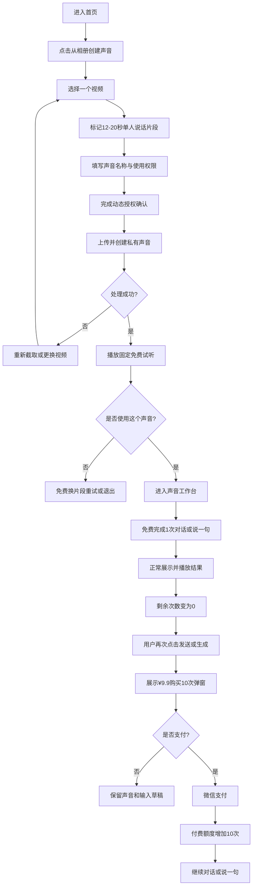
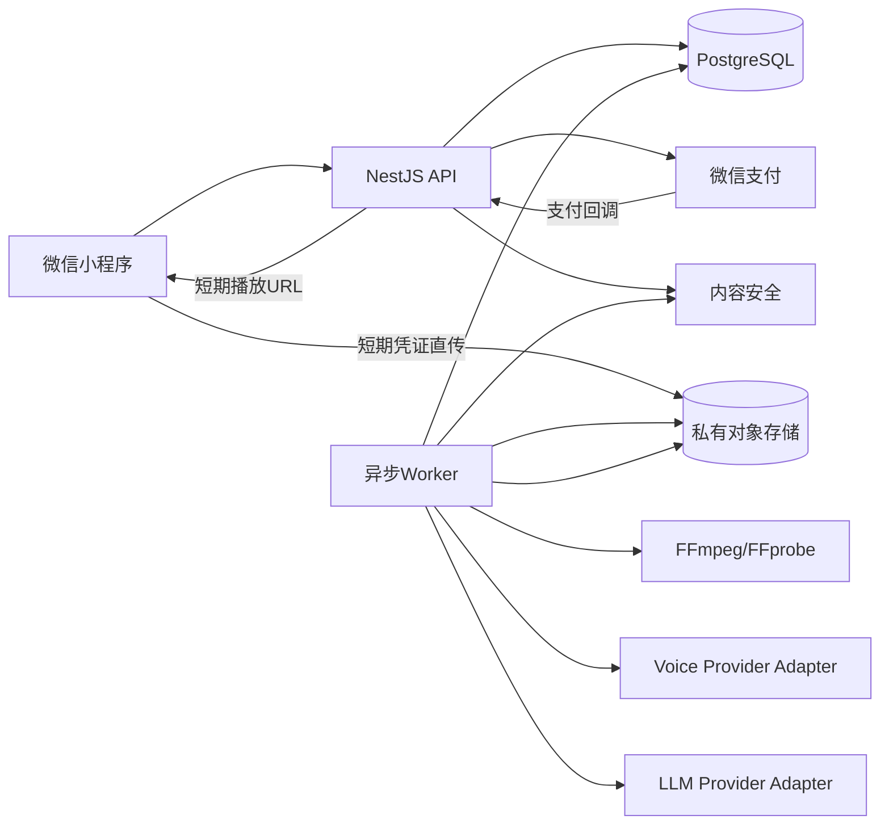
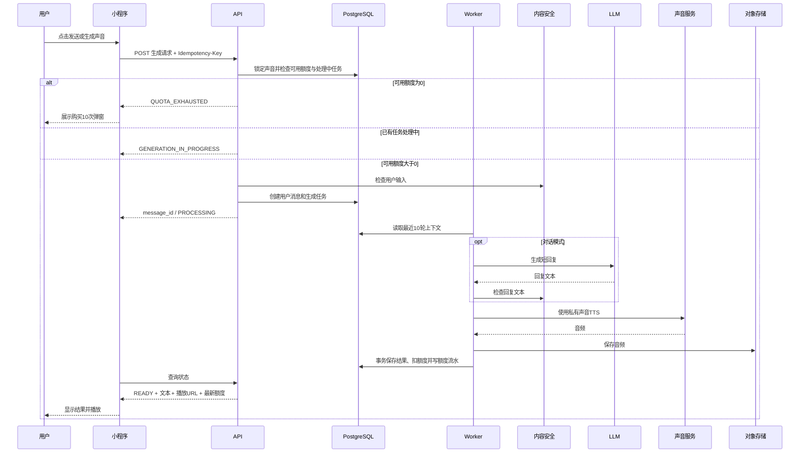

# 「那时的 TA」微信小程序 MVP 需求文档

> **2026-08-21 商业合同变更（优先于本文全部旧次数规则）**  
> 账户采用统一积分余额，所有声音共享。新注册账号仅赠送一次 10 积分；每次成功生成扣 1 积分，失败不扣；¥9.9 购买 50 积分，可重复购买，用完再买且不自动续费。注册送分、单次消耗、商品价格、商品积分数和有效期均由后端配置，客户端不得自行计算或记账。积分流水须区分 `REGISTER_GRANT`、`PURCHASE_GRANT`、`GENERATION_CONSUME`、`REFUND`、`MANUAL_ADJUSTMENT`，并预留 `INVITE_GRANT`；本版本不实现邀请功能。本文后续出现的“免费 1 次”“¥9.9/10 次”“按声音免费/付费分账”等旧描述全部废止，由本段统一替代。

> 工作名称：那时的 TA  
> 文档类型：产品需求文档（PRD）+ 技术实现方案 + 页面设计  
> 版本：v0.4（先体验后付费版）  
> 日期：2026-08-21  
> 产品形态：微信小程序  
> 运营主体：个体工商户  
> MVP 售价：¥9.9 / 50 积分
> 免费体验：新注册微信账号赠送 10 积分
> 文档目标：以最小开发范围验证用户在完成固定试听并进行至少 1 次个性化语音体验后，是否愿意支付 ¥9.9 继续使用熟悉的私有 AI 声音。

---

# 0. 本次重大修订

本版本在 v0.3“通用私有声音版”的基础上，重点重构首页、授权、试听反馈和商业化路径。产品定位不变，但用户首次体验和付费触发方式发生重大调整。

## 0.1 首页不再展示处理中任务

首页只承担两个高频任务：

```text
创建一个新的声音
+
最近使用
```

处理中、失败、草稿等低频状态统一放入“我的声音”。

这样可以避免首页长期出现低频任务区，也让首页结构在没有处理中项目时保持稳定。

## 0.2 “声音来源”改为“声音使用权限”

页面不再把该字段包装成人物资料，而是明确说明其用途是授权确认：

```text
我的声音
他人的声音
未成年人的声音
```

三种选择分别触发不同的确认文案。系统仍需记录选择、同意文本版本和同意时间，但 MVP 不要求身份证或亲属关系证明。

## 0.3 删除“很像 / 比较像 / 不像”必经评价

用户试听后的真实行为已经能够表达结果：

```text
使用这个声音
换一段重新创建
```

因此不再强迫用户填写相似度问卷。产品通过播放完成、接受试听、重试、退出和后续购买等行为埋点判断效果。

## 0.4 从“试听后立即付费”改为“先体验一次，再决定购买”

新的首次体验路径：

```text
固定试听免费
→ 用户接受这个声音
→ 免费完成 1 次自定义生成
→ 正常查看和播放结果
→ 剩余次数变为 0
→ 用户下一次点击发送或生成时出现购买框
→ ¥9.9 购买 10 次
```

固定试听用于验证声音效果；账户级积分体验用于验证用户输入自己的内容后，产品是否真正有价值。

## 0.5 购买框不在最后一次结果生成后自动弹出

当用户完成最后一次可用生成后：

1. 正常展示文字和音频结果；
2. 正常允许完整播放；
3. 页面只把剩余次数更新为 0；
4. 用户下一次主动点击“发送”或“生成声音”时，再出现购买框。

不得用购买弹窗遮挡刚生成的结果。

## 0.6 额度改为账号统一积分余额

逻辑上统一为账号级积分：

```text
新注册账号赠送 10 积分
→ 所有声音共享同一余额
→ 每次成功生成消耗 1 积分
→ 失败不扣
→ 余额为 0 时返回 POINTS_EXHAUSTED
```

系统增加积分流水，记录注册赠送、购买到账、成功消耗、退款和人工调整，避免重复支付回调、并发生成和售后补偿造成账目不一致，并预留邀请奖励类型供后续版本使用。

---

# 1. 产品定位

## 1.1 一句话定义

> **从相册视频里，创建一个熟悉的私有声音，用它继续聊几句。**

## 1.2 对外主标题

> **从旧视频里，找回一个熟悉的声音。**

副标题：

> 导入一段视频，创建私有 AI 声音，先免费体验一次，再继续对话或让它说一句新话。

## 1.3 产品本质

本产品不是“儿童产品”，也不是“逝者复活产品”。

产品本质是：

```text
视频导入工具
+
私有声音创建工具
+
轻量 AI 对话工具
```

## 1.4 典型使用场景

产品首页和市场素材可以展示多种场景：

1. 孩子小时候的声音；
2. 父母年轻时的声音；
3. 以前的自己；
4. 爱人或朋友授权的声音；
5. 爷爷奶奶的声音；
6. 某个时期、某种方言状态下的自己；
7. 用户当前重新录制的本人声音。

## 1.5 产品不做的承诺

不得宣传：

- AI 复活；
- TA 真的回来了；
- 真人在线；
- 数字永生；
- 完整复制某人的思想；
- 完整还原某人的人格和记忆；
- AI 就是声音本人；
- 永久拥有不可迁移的声音模型。

统一真实性说明：

> 本产品使用 AI 生成回复和语音，生成内容不代表声音本人真实表达。

该说明不需要在每个页面大段重复，只需：

- 首次创建时确认；
- AI 回复或生成音频旁显示“AI生成”；
- 服务协议中完整说明。

---

# 2. MVP 核心验证

## 2.1 核心假设 H1：个性化体验能否触发付费

用户听完固定试听，并使用该声音成功完成 1 次自己的个性化生成后，是否愿意支付 ¥9.9 购买 10 次继续使用。

本版本不再把“填写很像/比较像”作为付费前提，也不再用主观问卷作为核心指标。

## 2.2 核心假设 H2：付费后是否存在真实使用

付费后，用户是否会完成至少 3 次 AI 语音回复或“说一句”生成，而不是只因一次性好奇购买。

## 2.3 次级假设 H3：是否存在回访

用户在首次创建后的 7 天内，是否会再次打开该声音并继续对话或生成新语音。

## 2.4 建议验证标准

| 指标 | 继续投入 | 需要优化 | 暂停扩展 |
|---|---:|---:|---:|
| 试听接受率 | ≥60% | 40%–59% | <40% |
| 免费自定义体验完成率 | ≥70% | 50%–69% | <50% |
| 购买框曝光后的支付转化率 | ≥15% | 8%–14% | <8% |
| 付费用户完成 ≥3 次生成 | ≥30% | 15%–29% | <15% |
| 首次声音创建成功率 | ≥70% | 50%–69% | <50% |
| 7日内再次进入声音页 | ≥20% | 10%–19% | <10% |
| 退款或严重投诉率 | <5% | 5%–10% | >10% |

指标口径：

```text
试听接受率
= 点击“使用这个声音”的用户数
÷ 完整播放固定试听的用户数
```

```text
免费自定义体验完成率
= 成功完成首次自定义生成的用户数
÷ 点击“使用这个声音”且获得免费额度的用户数
```

```text
购买框曝光后的支付转化率
= 支付成功用户数
÷ 因额度为 0 而看到购买框的去重用户数
```

不能使用首页访问人数、试听生成成功人数或购买按钮曝光前的人数作为支付转化分母。

---

# 3. 目标用户

## 3.1 第一目标用户

手机相册中保存着家人、自己或重要人物视频，并希望重新使用该声音进行互动的成年人。

典型特征：

- 相册中有大量旧视频；
- 对某个声音有明显情绪价值；
- 不会使用专业音频剪辑或声音模型工具；
- 愿意先体验真实的个性化生成，再为低价次数包付款；
- 能完成微信支付；
- 接受生成结果是 AI 内容。

## 3.2 高优先级场景

按传播力而不是产品限制排序：

1. 孩子小时候；
2. 父母或祖辈；
3. 以前的自己；
4. 伴侣或朋友；
5. 个人方言、年轻时期或特殊时期的声音。

## 3.3 暂不服务的人群与用途

- 未满 18 周岁的创建者；
- 未取得声音本人或合法权利人授权的人；
- 上传明星、网红、公众人物或陌生人的网络视频；
- 使用声音完成身份认证、验证码、转账、借款、广告推销；
- 使用声音进行电话外呼、诈骗或冒充；
- 需要公开音色广场或开放 API 的用户；
- 需要全自动扫描整个相册的用户；
- 需要实时电话式对话的用户。

---

# 4. 产品方案

## 4.1 核心产品对象：私有声音

一个“私有声音”包含：

```text
声音名称
声音使用权限类型
可选阶段标签
可选称呼
对话风格
声音样本
供应商音色ID
生成记录
对话记录
免费体验额度
付费额度
额度流水
```

示例：

```text
妈妈
小雨 · 5岁
大学时的我
爷爷
厦门工作时期的我
```

## 4.2 两种使用模式

### 模式 A：对话

用户输入一条消息，系统生成简短回复，并使用当前私有声音播放。

```text
用户：今天工作特别累。

AI回复：辛苦啦，先喝点水，今晚早点休息。

▶ 使用“妈妈”的私有声音播放
```

MVP 只保留最近 10 轮上下文，不建立长期记忆。

### 模式 B：说一句

用户输入精确内容，系统不改写文本，只用当前私有声音朗读。

```text
用户输入：明天记得带伞。

生成：完全按照输入文字朗读
```

## 4.3 AI 对话边界

MVP 的 AI 不是“某个真实人物的数字人格”，而是：

> **一个使用该私有声音输出的 AI 对话助手。**

系统必须遵守：

- 不声称自己就是真实人物；
- 不编造“我们以前发生过什么”；
- 不主动制造已故、复活、永生等叙事；
- 不声称拥有真人记忆；
- 不诱导用户产生排他性或依赖性关系；
- 用户询问“你是谁”时，明确回答是 AI 生成的声音助手；
- 回复长度默认不超过 80 个中文字符；
- 默认自然、克制，不故意模仿儿童、老人或特定人格。

## 4.4 最少声音资料与权限确认

创建时只收集最少信息：

| 字段 | 是否必填 | 用途 |
|---|---:|---|
| 声音名称 | 是 | 展示，如“妈妈” |
| 声音使用权限 | 是 | 我的声音 / 他人的声音 / 未成年人的声音 |
| 阶段标签 | 否 | 如“5岁”“2018年”“大学时期” |
| TA如何称呼你 | 否 | 用于自然称呼 |
| 对话风格 | 否 | 自然 / 温柔 / 活泼 / 沉稳 |

三种权限对应的确认文案：

### 我的声音

> 我同意使用我的声音样本创建私有 AI 声音。

### 他人的声音

> 我已告知声音本人，并取得其对声音克隆和 AI 合成使用的明确同意。

### 未成年人的声音

> 我是该未成年人的监护人，或已取得其监护人的明确授权。

不收集：

- 大量人生经历；
- 性格问卷；
- 家庭关系图谱；
- 通讯录；
- 全量聊天记录；
- 身份证或亲属关系证明。

## 4.5 免费体验与购买关系

固定试听和自定义体验是两种不同能力：

```text
固定试听
= 系统使用固定文案生成，用于判断声音效果

自定义体验
= 用户输入自己的内容，系统生成真正属于本次使用场景的结果
```

每个微信账号最多赠送 1 次自定义生成额度，并绑定到该账号第一个点击“使用这个声音”的私有声音。

后续新建声音仍可获得固定试听，但不重复赠送自定义生成额度。

---

# 5. MVP 功能范围

## 5.1 本期必须完成

1. 微信授权登录；
2. 常驻底部 TabBar；
3. 首页新建入口和最近声音；
4. 从相册选择 1 个视频；
5. 用户手动标记单人说话片段；
6. 填写声音名称和最少资料；
7. 选择声音使用权限并完成动态授权确认；
8. 后端提取 12–20 秒音频；
9. 基础音频质量检查；
10. 创建 1 个私有声音版本；
11. 免费生成 1 句固定试听；
12. 支持“使用这个声音”和“换片段重新创建”；
13. 每个微信账号最多赠送 1 次自定义 AI 语音生成；
14. 支持“对话”模式；
15. 支持“说一句”模式；
16. 免费额度和付费额度分账；
17. 免费额度用完后，下一次生成动作才展示购买框；
18. 微信支付 ¥9.9；
19. 每次支付增加 10 次成功的 AI 语音输出；
20. 保存最近 10 轮对话；
21. 我的声音列表，包括已完成、处理中和草稿；
22. 我的页面；
23. 声音删除、对话记录删除和账号注销；
24. AI 生成标识；
25. 内容安全检查；
26. 支付、生成、额度和删除操作幂等；
27. 额度流水与支付对账；
28. 完整埋点。

## 5.2 本期明确不做

- 自动扫描整个相册；
- 自动识别人脸或说话人；
- 多人声音分离；
- 重叠语音处理；
- 强降噪和复杂音频修复；
- 实时通话；
- 语音打断；
- 语音输入；
- 长期记忆；
- 人格复制；
- 情感依赖型陪伴；
- 照片开口；
- 数字人；
- 视频通话；
- 声音模型下载；
- 公开音色广场；
- 开放 API；
- 电话外呼；
- 无标识音频导出；
- 月度会员；
- 自动续费；
- App；
- Web 端；
- 复杂运营后台。

---

# 6. 商品、免费体验与价格

## 6.1 固定试听免费

每个成功创建的声音可免费获得：

- 创建 1 个声音草稿；
- 截取 1 段视频中的人声；
- 创建 1 次私有声音试听；
- 播放 1 句固定试听；
- 效果不满意时免费更换片段重试 1 次。

固定试听不扣免费自定义额度，也不扣付费额度。

固定试听句：

```text
如果填写了“TA如何称呼你”：
{{称呼}}，今天过得怎么样？

如果未填写：
你好呀，今天过得怎么样？
```

## 6.2 免费自定义生成

每个微信账号最多赠送 1 次自定义 AI 语音生成：

- 可以用于“对话”或“说一句”；
- 两种模式共用这 1 次；
- 仅成功生成并保存结果后消耗；
- 内容审核未通过、模型失败、超时或网络失败不消耗；
- 免费额度绑定到首次接受试听的声音；
- 删除声音或继续新建声音不重新赠送；注销后的反滥用处理以正式隐私规则为准；
- 服务端以微信账号和额度流水为准，不能只依赖前端状态。

## 6.3 ¥9.9 付费包

一次支付包含：

- 当前私有声音增加 10 次成功的 AI 语音输出；
- “对话”和“说一句”共用额度；
- 每次 AI 回复最多 80 个中文字符；
- 每次“说一句”最多 50 个中文字符；
- 最近 10 轮对话上下文；
- 生成结果保存在小程序内；
- 可反复播放；
- 不自动续费；
- 不提供声音模型下载；
- 不提供无标识音频导出。

付费包不是“解锁声音”。声音在固定试听完成后已经创建并可被用户管理，支付购买的是继续生成次数。

统一使用以下文案：

```text
购买10次
继续使用
再购买10次
```

不得使用：

```text
解锁私有声音
解锁并开始对话
```

## 6.4 额度规则

可用额度：

```text
available_quota
= trial_quota_remaining + paid_quota_remaining
```

扣减顺序：

```text
trial_quota_remaining > 0
→ 优先扣免费体验额度

否则 paid_quota_remaining > 0
→ 扣付费额度

否则
→ 返回 QUOTA_EXHAUSTED
```

其他规则：

- 仅生成成功并保存结果后最终扣减 1 次；
- 文本审核未通过不扣次数；
- 模型失败、超时、网络错误不扣次数；
- 同一声音同一时间只允许 1 个生成任务处理中；
- 重复请求由幂等键合并；
- 删除已经成功生成的结果不返还次数；
- “对话”和“说一句”均扣 1 次；
- 重复购买每次在现有付费余额上增加 10 次，不覆盖旧余额；
- 退款是否回收未使用额度，由退款状态机统一处理。

## 6.5 价格披露与购买触发

试听页提前显示一行非阻断价格说明：

> 后续 ¥9.9 可购买 10 次生成，对话和“说一句”共用，不自动续费。

用户完成最后一次可用生成后，不自动弹出购买框。只有下一次主动点击以下动作时才触发：

```text
对话页点击“发送”
说一句页点击“生成声音”
```

购买框：

```text
继续使用“妈妈”

免费体验次数已用完

¥9.9 / 10次AI语音生成

· 对话和“说一句”共用
· 仅成功生成后扣次数
· 失败不扣次数
· 不自动续费

[ 购买10次 ]
[ 暂不购买 ]
```

付费额度再次用完时，说明改为：

```text
本次购买的生成次数已经用完
[ 再购买10次 ]
```

---

# 7. 信息架构

## 7.1 常驻底部 TabBar

```text
首页 ｜ 我的声音 ｜ 我的
```

### 首页

- 新建声音；
- 最近使用；
- 继续对话；
- 快速查看最近声音剩余次数。

首页不展示处理中、失败或草稿任务。

### 我的声音

- 全部声音资产；
- 已完成、处理中、草稿；
- 恢复创建进度；
- 进入对话；
- 进入“说一句”；
- 声音设置和删除。

### 我的

- 账户；
- 订单；
- 剩余次数汇总；
- 客服；
- 数据与隐私；
- 协议；
- 注销。

## 7.2 页面目录

```text
pages/
├── home/index                       首页
├── voices/index                     我的声音
├── profile/index                    我的
├── create/select-video              选择视频
├── create/select-clip               选择声音片段
├── create/voice-profile             声音信息与权限确认
├── create/processing                创建进度
├── create/preview                   免费试听
├── voice/workspace                  声音工作台：对话 / 说一句
├── voice/settings                   声音设置
├── voice/history                    对话与生成记录
├── orders/index                     订单
└── privacy/index                    数据与隐私

components/
└── quota-purchase-dialog            次数购买弹窗
```

购买框使用组件或页面内弹层，不把首次试听页设计成支付页。

---

# 8. 用户流程

## 8.1 新用户主流程



## 8.2 已使用过账号免费体验的创建流程

```text
创建新的声音
→ 固定试听免费
→ 点击“使用这个声音”
→ 进入声音工作台
→ 当前可用额度为0
→ 用户首次点击发送或生成时展示购买框
```

后续新建声音不重复赠送账号级免费自定义额度。

## 8.3 老用户回访流程

```text
打开首页
→ 最近使用
→ 点击“继续对话”
→ 进入该声音工作台
→ 查看历史并发送新消息
```

若余额为 0：

```text
用户仍可查看和播放历史结果
→ 用户点击发送或生成
→ 展示购买框
```

## 8.4 我的声音流程

```text
我的声音
→ 查看已完成 / 处理中 / 草稿
→ 选择一个声音
→ 对话 / 说一句 / 查看进度 / 查看记录 / 设置 / 删除
```

## 8.5 最短完成路径

```text
首页
→ 从相册导入
→ 截取人声
→ 起一个名字并确认使用权限
→ 固定免费试听
→ 使用这个声音
→ 免费输入自己的内容并生成1次
→ 再次生成时购买¥9.9 / 10次
→ 继续使用
```

---

# 9. 页面设计

## 9.1 全局视觉原则

### 气质

- 温暖但不局限亲子；
- 简洁、真实、克制；
- 不做儿童玩具风；
- 不做悲伤纪念风；
- 不做科幻数字人风；
- 不使用“在线”“TA正在输入”“TA回来了”等误导表达。

### 颜色

| 用途 | 色值 |
|---|---|
| 页面背景 | `#FFF9F5` |
| 卡片背景 | `#FFFFFF` |
| 主文字 | `#2B2725` |
| 次文字 | `#756D68` |
| 主按钮 | `#FF7256` |
| 轻强调背景 | `#FFF0E8` |
| 成功状态 | `#2F8F62` |
| 风险提示 | `#C24E3D` |
| 分割线 | `#EEE7E2` |
| Tab 未选中 | `#9C938D` |

### 尺寸

- 页面左右边距：16–20px；
- 主按钮高度：50–52px；
- 卡片圆角：16px；
- 输入框圆角：12px；
- 主标题：26–28px / 700；
- 页面标题：20px / 600；
- 正文：16px；
- 辅助文字：13px；
- TabBar 高度：按微信原生安全区适配；
- 触控区域最小高度：44px。

---

## 9.2 P0：首页

### 页面目标

首页是工作台，不是单次营销落地页。

它必须同时回答：

1. 新用户怎么创建声音；
2. 老用户怎么继续使用最近的声音。

处理中、失败和草稿任务不在首页展示，统一由“我的声音”承接。

### 新用户状态线框

```text
┌────────────────────────────┐
│ 那时的TA                    │
│                            │
│ ┌────────────────────────┐ │
│ │ 从旧视频里，找回一个      │ │
│ │ 熟悉的声音。              │ │
│ │                          │ │
│ │ 导入一段相册视频，创建      │ │
│ │ 私有AI声音，继续聊几句。    │ │
│ │                          │ │
│ │ [ 从相册导入视频 ]         │ │
│ └────────────────────────┘ │
│                            │
│ 只需三步                     │
│ ① 选视频  ② 截声音  ③ 开始体验│
│                            │
│ 私有声音，仅自己可用，可随时删除 │
│                            │
├────────┬────────┬──────────┤
│  首页   │ 我的声音 │   我的    │
└────────┴────────┴──────────┘
```

### 老用户状态线框

```text
┌────────────────────────────┐
│ 那时的TA                    │
│                            │
│ ┌────────────────────────┐ │
│ │ 创建一个新的声音           │ │
│ │ [ 从相册导入视频 ]         │ │
│ └────────────────────────┘ │
│                            │
│ 最近使用                     │
│ ┌────────────────────────┐ │
│ │ [头像] 妈妈               │ │
│ │ 上次：今天 09:30          │ │
│ │ 剩余 6 次                 │ │
│ │              [继续对话]   │ │
│ └────────────────────────┘ │
│ ┌────────────────────────┐ │
│ │ [头像] 大学时的我          │ │
│ │ 上次：昨天                │ │
│ │ 剩余 10 次                │ │
│ │              [继续对话]   │ │
│ └────────────────────────┘ │
│                            │
├────────┬────────┬──────────┤
│  首页   │ 我的声音 │   我的    │
└────────┴────────┴──────────┘
```

### 首页规则

- 创建入口始终可见；
- 最近使用最多展示 3 个已可用声音；
- 不展示处理中、失败或草稿卡片；
- 余额为 0 的声音仍可进入，以查看和播放历史内容；
- “继续对话”直接进入声音工作台；
- 只保留一行信任说明：`私有声音，仅自己可用，可随时删除`。

### 埋点

- `home_view`
- `home_create_voice_click`
- `home_recent_voice_click`
- `home_continue_chat_click`
- `tab_click`

---

## 9.3 P1：选择视频

### 页面目标

帮助用户选择容易成功的视频，不强调特定人物身份。

### 页面线框

```text
┌────────────────────────────┐
│ ‹ 选择视频                   │
│                            │
│ 请选择这样的片段：             │
│                            │
│ ✓ 目标人物单独说话             │
│ ✓ 声音清楚                    │
│ ✓ 没有电视或音乐声             │
│ ✓ 视频不超过60秒              │
│                            │
│ [ 从相册选择视频 ]             │
│                            │
│ 本次只处理你主动选择的视频。     │
└────────────────────────────┘
```

### 前端校验

- 仅允许视频；
- 12–60 秒；
- 建议不超过 100MB；
- 一次只选 1 个；
- 不扫描其他相册内容。

---

## 9.4 P2：选择声音片段

### 页面目标

由用户判断目标人物单独说话的片段，MVP 不做自动说话人识别。

### 页面线框

```text
┌────────────────────────────┐
│ ‹ 选择目标声音               │
│                            │
│ ┌────────────────────────┐ │
│ │       视频播放器          │ │
│ └────────────────────────┘ │
│ 当前 00:16                  │
│                            │
│ [设为开始]       [设为结束]   │
│                            │
│ 已选择：00:12 — 00:29        │
│ 时长：17秒                   │
│                            │
│ [ ▶ 试听所选片段 ]            │
│                            │
│ □ 我确认这段主要是目标人物      │
│   清楚、单独说话               │
│                            │
│ [ 使用这段声音 ]               │
│                            │
│ 有多人同时讲话时，请换一个片段。  │
└────────────────────────────┘
```

### 规则

- 推荐 12–20 秒；
- 最大 30 秒；
- 开始时间早于结束时间；
- 未确认单人声音不能继续；
- 不出现“孩子本人”等限定性文案。

---

## 9.5 P3：声音信息与权限确认

### 页面目标

收集最少资料，并明确完成声音使用权限确认。

### 页面线框

```text
┌────────────────────────────┐
│ ‹ 给这个声音起个名字          │
│                            │
│ 声音名称 *                   │
│ [ 妈妈                    ]  │
│                            │
│ 阶段标签（可选）               │
│ [ 年轻时 / 5岁 / 2018年      ]│
│                            │
│ TA如何称呼你（可选）           │
│ [ 小林                    ]  │
│                            │
│ 对话风格（可选）               │
│ [自然] [温柔] [活泼] [沉稳]    │
│                            │
│ 声音使用权限 *                │
│ [我的声音] [他人的声音]        │
│ [未成年人的声音]              │
│                            │
│ 声音使用确认                  │
│ □ [根据选择动态显示确认文案]     │
│                            │
│ [ 查看声音使用规则 ]           │
│                            │
│ [ 开始创建免费试听 ]            │
│                            │
│ AI生成内容会显示“AI生成”标识。   │
└────────────────────────────┘
```

### 动态确认文案

选择“我的声音”：

```text
我同意使用我的声音样本创建私有AI声音。
```

选择“他人的声音”：

```text
我已告知声音本人，并取得其对声音克隆和AI合成使用的明确同意。
```

选择“未成年人的声音”：

```text
我是该未成年人的监护人，或已取得其监护人的明确授权。
```

### 交互原则

- 必须先选择声音使用权限；
- 只展示与当前选择匹配的一条确认文案；
- 未勾选动态确认不能提交；
- 默认不展示大段法律文字；
- 完整说明通过“查看声音使用规则”打开；
- 不要求身份证、亲属关系材料；
- 服务端记录权限类型、授权版本、文本哈希、时间和客户端版本。

---

## 9.6 P4：创建进度

### 页面线框

```text
┌────────────────────────────┐
│ 创建声音                     │
│                            │
│       [声音波形动效]           │
│                            │
│ 正在创建“妈妈”的私有声音        │
│                            │
│ ✓ 已收到视频                  │
│ ✓ 正在提取所选片段             │
│ ○ 检查声音质量                │
│ ○ 创建私有声音                │
│ ○ 生成免费试听                │
│                            │
│ 离开后可在“我的声音”查看进度。   │
└────────────────────────────┘
```

### 状态

```text
UPLOADING
→ EXTRACTING
→ QUALITY_CHECKING
→ ENROLLING
→ PREVIEW_GENERATING
→ PREVIEW_READY
```

### 用词规则

允许：

- 正在创建 AI 声音；
- 正在生成 AI 回复；
- 正在处理音频。

禁止：

- TA 正在想；
- TA 正在输入；
- TA 回来了；
- TA 在线。

---

## 9.7 P5：免费试听

### 页面目标

让用户听见固定试听，直接决定“使用”或“重试”，不在该页强迫评价，也不在该页要求立即付款。

### 首次仍有免费自定义额度

```text
┌────────────────────────────┐
│ ‹ 妈妈                      │
│                            │
│ 免费试听已生成               │
│                            │
│ ┌────────────────────────┐ │
│ │ ▶ 00:04                 │ │
│ │ “小林，今天过得怎么样？”  │ │
│ │ AI生成                   │ │
│ └────────────────────────┘ │
│                            │
│ [ 使用这个声音，免费体验1次 ] │
│                            │
│ [ 换一段重新创建 ]            │
│                            │
│ 后续¥9.9购买10次生成，         │
│ 对话和“说一句”共用，不自动续费。│
└────────────────────────────┘
```

### 账号免费体验已使用

```text
┌────────────────────────────┐
│ ‹ 大学时的我                │
│                            │
│ 免费试听已生成               │
│                            │
│ ┌────────────────────────┐ │
│ │ ▶ 00:04                 │ │
│ │ “你好呀，今天过得怎么样？”│ │
│ │ AI生成                   │ │
│ └────────────────────────┘ │
│                            │
│ [ 使用这个声音 ]              │
│                            │
│ [ 换一段重新创建 ]            │
│                            │
│ 你的免费自定义体验已使用。      │
│ 后续¥9.9购买10次生成。         │
└────────────────────────────┘
```

### 页面规则

- 用户至少完整播放一次试听后，才高亮“使用这个声音”；
- 不展示“很像 / 比较像 / 不像”；
- 点击“使用这个声音”即视为试听结果可接受；
- 点击“换一段重新创建”即视为当前效果不满意；
- 免费换片段最多 1 次；
- 点击使用后保存 `accepted_at`；
- 若账号仍有免费资格，服务端原子赠送 1 次并绑定当前声音；
- 若账号已使用免费资格，仍可进入工作台查看声音，生成时再购买；
- 试听页提前披露价格，但不展示大块购买权益卡，不直接弹支付。

### 埋点

- `preview_play_start`
- `preview_play_complete`
- `preview_accept_click`
- `preview_retry_click`
- `preview_abandon`
- `trial_quota_granted`

---

## 9.8 P6：声音工作台

声音工作台是产品核心页面。

顶部使用分段切换：

```text
对话 ｜ 说一句
```

### P6-A 对话模式

```text
┌────────────────────────────┐
│ ‹ 妈妈          免费体验1次 │
│ [ 对话 ]   [ 说一句 ]         │
│                            │
│ AI声音助手                   │
│                            │
│              我：今天好累。   │
│                            │
│ ┌────────────────────────┐ │
│ │ ▶ 00:05                 │ │
│ │ 辛苦啦，先喝点水，今晚    │ │
│ │ 早点休息。               │ │
│ │ AI回复                   │ │
│ └────────────────────────┘ │
│                            │
│ 快捷问题                     │
│ [陪我聊几句] [今天吃什么]      │
│                            │
│ [ 输入想说的话……       ] [发送]│
└────────────────────────────┘
```

付费后顶部显示：

```text
剩余6次
```

余额为 0 时显示：

```text
剩余0次
```

但历史内容仍可查看和播放，输入框也可以继续编辑。

### 对话规则

- MVP 仅支持文字输入；
- 使用最近 10 轮上下文；
- AI 回复不超过 80 个中文字符；
- 回复文本和音频同时展示；
- 每条 AI 消息显示“AI回复”；
- 生成过程中显示“正在生成AI回复”；
- 用户退出后可以继续当前对话；
- 新声音第一次进入时展示 3 个示例问题；
- 不显示“在线”“已读”“对方正在输入”；
- 同一声音存在处理中任务时，发送按钮进入禁用或等待状态；
- 可用额度为 0 时，点击“发送”先展示购买框，不创建消息任务；
- 购买取消后保留输入框草稿。

### P6-B 说一句模式

```text
┌────────────────────────────┐
│ ‹ 妈妈              剩余6次 │
│ [ 对话 ]   [ 说一句 ]         │
│                            │
│ 让这个声音说什么？             │
│ ┌────────────────────────┐ │
│ │ 明天记得带伞。            │ │
│ │                    7/50 │ │
│ └────────────────────────┘ │
│                            │
│ [ 生成声音 ]                 │
│                            │
│ 最近生成                     │
│ ▶ 明天记得带伞。  AI生成 00:03│
└────────────────────────────┘
```

### P6-C 次数购买弹窗

首次免费额度用完后，用户下一次点击生成动作时：

```text
┌────────────────────────────┐
│ 继续使用“妈妈”               │
│                            │
│ 免费体验次数已用完            │
│                            │
│ ¥9.9 / 10次AI语音生成         │
│                            │
│ · 对话和“说一句”共用           │
│ · 仅成功生成后扣次数           │
│ · 失败不扣次数                │
│ · 不自动续费                  │
│                            │
│ [ 购买10次 ]                 │
│ [ 暂不购买 ]                 │
└────────────────────────────┘
```

付费额度用完后：

```text
本次购买的生成次数已经用完
[ 再购买10次 ]
```

交互规则：

1. 最后一次生成成功后不自动弹窗；
2. 用户可以先完整查看和播放结果；
3. 下一次生成动作才弹窗；
4. 支付成功后付费余额增加 10；
5. 支付前输入的文字草稿必须保留；
6. 支付成功返回工作台后，用户可继续发送；
7. 客户端不能仅凭 `wx.requestPayment` 成功回调加额度，必须查询服务端订单状态。

### 工作台菜单

右上角更多菜单：

- 查看记录；
- 修改名称；
- 修改对话风格；
- 清空当前对话；
- 删除声音。

---

## 9.9 P7：我的声音

### 页面目标

管理全部声音资产，并承接处理中、失败和草稿任务。

### 页面线框

```text
┌────────────────────────────┐
│ 我的声音              [+ 新建]│
│                            │
│ 全部  已完成  处理中  草稿      │
│                            │
│ ┌────────────────────────┐ │
│ │ [头像] 妈妈               │ │
│ │ 温柔 · 剩余6次            │ │
│ │ [继续对话] [说一句]        │ │
│ └────────────────────────┘ │
│                            │
│ ┌────────────────────────┐ │
│ │ [头像] 大学时的我          │ │
│ │ 自然 · 剩余0次            │ │
│ │ [继续对话] [说一句]        │ │
│ └────────────────────────┘ │
│                            │
│ 处理中                       │
│ 小雨·5岁  65%   [查看进度]    │
│                            │
│ 草稿                         │
│ 爷爷  免费试听未完成    [继续] │
│                            │
├────────┬────────┬──────────┤
│  首页   │ 我的声音 │   我的    │
└────────┴────────┴──────────┘
```

### 卡片字段

- 声音名称；
- 阶段标签；
- 对话风格；
- 可用次数；
- 最近使用时间；
- 处理状态；
- 继续对话；
- 说一句；
- 查看进度或继续草稿。

---

## 9.10 P8：我的

### 页面线框

```text
┌────────────────────────────┐
│ 我的                         │
│                            │
│ [微信头像] 用户昵称           │
│                            │
│ 账户与订单                    │
│ · 我的订单                   │
│ · 剩余生成次数               │
│ · 退款与售后                 │
│                            │
│ 服务                         │
│ · 使用帮助                   │
│ · 联系客服                   │
│ · 意见反馈                   │
│                            │
│ 设置                         │
│ · 数据与隐私                 │
│ · 声音使用规则               │
│ · 隐私政策                   │
│ · 服务协议                   │
│ · 注销账号                   │
│                            │
├────────┬────────┬──────────┤
│  首页   │ 我的声音 │   我的    │
└────────┴────────┴──────────┘
```

首页和“我的声音”不再放大面积协议与隐私入口。

---

## 9.11 P9：声音设置与数据管理

### 页面线框

```text
┌────────────────────────────┐
│ ‹ 声音设置                   │
│                            │
│ 名称               妈妈  ›   │
│ 阶段标签           年轻时  ›   │
│ 对话风格             温柔  ›   │
│ TA如何称呼你          小林  ›   │
│                            │
│ 次数                         │
│ 可用次数              6次  ›   │
│ 购买记录                   ›   │
│                            │
│ 数据                         │
│ 清空对话记录               ›   │
│ 删除生成结果               ›   │
│ 删除声音样本               ›   │
│ 删除私有声音               ›   │
│                            │
│ [ 删除整个声音 ]              │
└────────────────────────────┘
```

删除声音时二次确认：

```text
删除后将无法恢复：
· 声音样本
· 私有声音模型
· 对话和生成记录
· 尚未使用的该声音额度

账号级免费体验资格不会因删除而恢复。
订单记录将按必要期限保留。
```

---

# 10. 交互与业务规则

## 10.1 首页与 TabBar

- 使用微信原生 TabBar；
- TabBar 在创建流程中隐藏；
- 返回首页后恢复；
- Tab 切换不清空正在处理任务；
- 首页不展示处理中任务；
- 处理中、失败和草稿仅在“我的声音”展示；
- 创建进度页和“我的声音”的处理状态必须一致。

## 10.2 试听接受与免费额度赠送

点击“使用这个声音”时，服务端执行：

```text
BEGIN
  锁定用户记录
  保存 voice_profile.accepted_at
  若用户从未获得账号级免费自定义额度：
      绑定 trial_voice_profile_id
      trial_quota_remaining = 1
      写入 TRIAL_GRANT 额度流水
      记录 trial_custom_generation_granted_at
COMMIT
```

重复点击、重复请求或多设备并发不能重复赠送。

## 10.3 购买触发

当用户点击“发送”或“生成声音”时：

```text
available_quota > 0
→ 正常创建生成任务

available_quota = 0
→ 不创建生成任务
→ 返回 QUOTA_EXHAUSTED
→ 客户端展示购买框
```

用户刚刚用完最后一次额度时，不主动展示购买框。

## 10.4 对话上下文

MVP 只使用最近 10 轮：

```text
最近10轮用户消息
+
最近10轮AI回复
+
声音资料中的称呼和风格
```

不使用：

- 全历史摘要；
- 人物关系图；
- 长期记忆向量库；
- 真实人物经历推断。

## 10.5 默认系统约束

```text
你是一个AI对话助手，回复将使用用户选择的私有声音播放。
你不是真实声音本人，不得声称自己是真人。
不得编造与用户的共同经历或真实人物记忆。
回复应自然、简短、友善，最多80个中文字符。
若用户询问你的身份，应明确说明你是AI生成的声音助手。
```

## 10.6 声音状态

```text
DRAFT
PROCESSING
PREVIEW_READY
READY
FAILED
DELETING
DELETED
```

状态说明：

- `PREVIEW_READY`：固定试听已生成，等待用户接受或重试；
- `READY`：用户已点击“使用这个声音”，可进入工作台；
- 是否有免费或付费额度不通过声音状态表达；
- 支付状态属于订单，不再把 `PAYMENT_PENDING` 作为声音状态；
- 余额为 0 的 `READY` 声音仍可查看历史和设置。

## 10.7 额度显示

前端统一显示：

```text
availableQuota = trialQuotaRemaining + paidQuotaRemaining
```

展示文案：

```text
trialQuotaRemaining = 1 且 paidQuotaRemaining = 0
→ 免费体验1次

availableQuota > 0
→ 剩余N次

availableQuota = 0
→ 剩余0次
```

前端显示值只用于界面，服务端必须在每次生成请求时重新校验。

## 10.8 分享

MVP 只支持分享小程序卡片，不直接分享可下载音频。

分享卡片内容：

```text
我创建了一个私有AI声音
进入小程序体验声音创建
```

不展示私人对话和声音名称，除非用户明确确认。

---

# 11. 技术实现方案

## 11.1 总体原则

1. 微信原生小程序；
2. TypeScript 全栈；
3. 一个 API 服务和一个异步 Worker；
4. PostgreSQL 承担业务数据和轻量任务队列；
5. 视频和音频放在中国境内私有对象存储；
6. 原视频短期保存；
7. Voice Provider 与 LLM Provider 均使用 Adapter；
8. 不在小程序端保存密钥；
9. 支付、生成、扣次数、删除全部幂等；
10. MVP 不做实时 WebSocket 语音通话。

## 11.2 推荐技术栈

### 小程序

- 微信小程序原生框架；
- TypeScript；
- WXML / WXSS；
- TDesign Miniprogram 可选；
- 原生 `tabBar`；
- `wx.login`；
- `wx.chooseMedia`；
- `<video>` + `VideoContext`；
- `wx.uploadFile` 或直传 OSS；
- `InnerAudioContext`；
- `wx.requestPayment`。

### 服务端

- Node.js；
- NestJS；
- TypeScript；
- PostgreSQL；
- Prisma 或 Drizzle；
- FFmpeg / FFprobe；
- pg-boss 或 PostgreSQL jobs 表；
- 阿里云 OSS 私有 Bucket；
- 已备案的国内声音复刻和 TTS 服务；
- 已备案的国内 LLM 服务；
- 内容安全服务；
- 微信支付 API v3；
- Sentry 或同类错误监控。

### 部署

```text
中国大陆云地域
├── API 容器
├── Worker 容器
├── PostgreSQL
├── 私有对象存储
├── 日志与告警
├── Voice Provider
├── LLM Provider
└── 内容安全服务
```

## 11.3 架构图



---

# 12. 音频处理

## 12.1 上传流程

1. 用户从相册选择视频；
2. 小程序读取时长和大小；
3. 用户在本地播放器标记起止时间；
4. 用户填写声音资料、选择声音使用权限并完成动态授权确认；
5. API 创建项目和上传凭证；
6. 小程序直传私有对象存储；
7. API 创建音频处理任务；
8. Worker 提取音频；
9. 质量检测；
10. 创建私有声音；
11. 生成试听；
12. 原视频进入自动删除队列。

## 12.2 文件限制

| 项目 | 限制 |
|---|---:|
| 视频数量 | 1 |
| 视频时长 | 12–60 秒 |
| 文件大小 | ≤100MB |
| 片段时长 | 推荐 12–20 秒，最大 30 秒 |
| 音频输出 | WAV，单声道，24kHz |

## 12.3 FFmpeg 示例

```bash
ffmpeg \
  -hide_banner \
  -nostdin \
  -i input.mp4 \
  -ss 12.400 \
  -t 17.000 \
  -vn \
  -ac 1 \
  -ar 24000 \
  -c:a pcm_s16le \
  output.wav
```

## 12.4 基础质量检测

| 检查项 | 建议阈值 |
|---|---:|
| 总片段时长 | 12–20 秒 |
| VAD 有效人声 | ≥8 秒 |
| 静音比例 | ≤40% |
| 平均音量 | 不低于约 -35 dBFS |
| 削波比例 | <1% |
| 可解码 | 必须通过 FFprobe |

MVP 不检测：

- 是否儿童；
- 是否具体某个人；
- 是否只有一个说话人；
- 是否与上传者存在真实关系。

单人声音和授权由用户确认，系统只做基础质量判断。

---

# 13. Provider Adapter

## 13.1 声音服务接口

```ts
export interface VoiceProvider {
  enrollVoice(input: {
    profileId: string;
    sampleUrl: string;
    language: 'zh';
    preprocess: boolean;
  }): Promise<{
    providerVoiceId: string;
    status: 'processing' | 'ready' | 'rejected';
  }>;

  getVoiceStatus(providerVoiceId: string): Promise<
    'processing' | 'ready' | 'rejected'
  >;

  synthesize(input: {
    providerVoiceId: string;
    text: string;
    requestId: string;
  }): Promise<{
    audio: Buffer;
    mimeType: 'audio/mpeg' | 'audio/wav';
    durationMs?: number;
  }>;

  deleteVoice(providerVoiceId: string): Promise<void>;
}
```

## 13.2 LLM 服务接口

```ts
export interface ChatProvider {
  reply(input: {
    conversationId: string;
    systemPrompt: string;
    messages: Array<{
      role: 'user' | 'assistant';
      content: string;
    }>;
    maxOutputChars: number;
    requestId: string;
  }): Promise<{
    text: string;
    providerRequestId?: string;
  }>;
}
```

## 13.3 供应商上线前阻断条件

必须确认：

1. 允许商业小程序使用；
2. 能提供深度合成类目所需算法备案材料；
3. 能与个体工商户主体签署或生成合作证明；
4. 样本不默认进入公共音色库；
5. 样本不默认用于训练；
6. 支持删除音色；
7. 数据处理地域和保存期限明确；
8. 对未成年人声音的处理规则明确；
9. 支持内容安全和生成标识配合；
10. 供应商条款允许收费场景。

---

# 14. AI 对话与语音生成链路

## 14.1 请求流程



## 14.2 额度检查与并发限制

MVP 对同一声音只允许 1 个生成任务处于 `PENDING` 或 `PROCESSING`：

```text
若存在处理中任务
→ 返回 GENERATION_IN_PROGRESS
→ 不创建第二个任务
```

这样可以在“仅成功后最终扣次数”的前提下，避免同一余额被多个并发任务同时占用。

## 14.3 成功扣减顺序

生成结果保存成功时，在同一数据库事务内：

```text
若 trial_quota_remaining > 0
→ trial_quota_remaining - 1
→ 写入 GENERATION_CONSUME / TRIAL

否则 paid_quota_remaining > 0
→ paid_quota_remaining - 1
→ 写入 GENERATION_CONSUME / PAID
```

消息、输出资源、额度余额和额度流水必须同时提交。任何一步失败都回滚。

## 14.4 失败处理

以下情况不最终扣次数：

- 输入内容审核未通过；
- LLM 失败；
- 输出内容审核未通过；
- TTS 失败；
- 对象存储失败；
- 数据库提交失败；
- Worker 超时或异常退出。

失败后消息状态设置为 `FAILED` 或 `BLOCKED`，并允许用户使用同一个输入重新发起新的幂等请求。

## 14.5 回复限制

- 最多 80 个中文字符；
- 默认一段，不输出长篇建议；
- 不执行身份核验；
- 不读取通讯录、相册或其他应用数据；
- 不输出验证码、转账和营销引导；
- 不冒充客服、公安、法院、银行等身份；
- 不声称自己是真实声音本人。

## 14.6 对话历史

- 默认保留最近 10 轮；
- 用户可清空；
- 清空后不参与后续上下文；
- MVP 不做向量数据库；
- MVP 不做跨声音共享记忆。

---

# 15. 数据模型

## 15.1 `users`

| 字段 | 类型 | 说明 |
|---|---|---|
| id | UUID | 主键 |
| wechat_openid_ciphertext | TEXT | 加密保存 |
| status | ENUM | ACTIVE / DELETED |
| trial_voice_profile_id | UUID NULL | 账号级免费体验绑定的声音 |
| trial_custom_generation_granted_at | TIMESTAMPTZ NULL | 首次赠送时间 |
| trial_custom_generation_consumed_at | TIMESTAMPTZ NULL | 免费体验成功消耗时间 |
| created_at | TIMESTAMPTZ | 创建时间 |
| deleted_at | TIMESTAMPTZ NULL | 注销时间 |

约束：

```text
一个用户最多存在一次账号级 TRIAL_GRANT
```

即使用户删除声音，也不能仅靠新建声音记录重复获得免费体验。注销后的反滥用标识是否保留、保留多久以及以何种去标识化方式保留，必须在隐私政策、数据删除规则和正式法律评估中确定；前端本地状态不能作为唯一依据。

## 15.2 `voice_profiles`

| 字段 | 类型 | 说明 |
|---|---|---|
| id | UUID | 私有声音ID |
| user_id | UUID | 所有者 |
| display_name_ciphertext | TEXT | 声音名称 |
| permission_type | ENUM | SELF / AUTHORIZED_ADULT / MINOR |
| stage_label_ciphertext | TEXT NULL | 阶段标签 |
| caller_name_ciphertext | TEXT NULL | 如何称呼用户 |
| conversation_style | ENUM | NATURAL / GENTLE / LIVELY / CALM |
| status | ENUM | 声音状态 |
| trial_quota_remaining | SMALLINT | 免费体验余额，0或1 |
| paid_quota_remaining | INT | 付费余额，可累计 |
| free_retry_count | SMALLINT | 免费换片段重试剩余次数 |
| accepted_at | TIMESTAMPTZ NULL | 用户接受固定试听时间 |
| first_paid_at | TIMESTAMPTZ NULL | 首次付款时间 |
| last_used_at | TIMESTAMPTZ NULL | 最近使用 |
| created_at | TIMESTAMPTZ | 创建 |
| deleted_at | TIMESTAMPTZ NULL | 删除 |

不存储 `available_quota` 和 `total_quota`，由服务端计算：

```text
available_quota = trial_quota_remaining + paid_quota_remaining
```

## 15.3 `media_assets`

| 字段 | 类型 | 说明 |
|---|---|---|
| id | UUID | 资源ID |
| voice_profile_id | UUID | 所属声音 |
| kind | ENUM | SOURCE_VIDEO / VOICE_SAMPLE / PREVIEW / OUTPUT |
| object_key | TEXT | 私有对象Key |
| mime_type | TEXT | MIME |
| size_bytes | BIGINT | 大小 |
| duration_ms | INT | 时长 |
| retention_until | TIMESTAMPTZ | 自动清理时间 |
| deleted_at | TIMESTAMPTZ NULL | 删除时间 |

## 15.4 `consent_records`

| 字段 | 类型 | 说明 |
|---|---|---|
| id | UUID | 主键 |
| user_id | UUID | 用户 |
| voice_profile_id | UUID | 声音 |
| consent_type | ENUM | SELF / THIRD_PARTY / GUARDIAN / BIOMETRIC / AI_NOTICE |
| policy_version | TEXT | 版本 |
| text_hash | TEXT | 本次展示确认文案的哈希 |
| granted_at | TIMESTAMPTZ | 同意时间 |
| revoked_at | TIMESTAMPTZ NULL | 撤回时间 |
| client_version | TEXT | 小程序版本 |

## 15.5 `voice_models`

| 字段 | 类型 | 说明 |
|---|---|---|
| id | UUID | 主键 |
| voice_profile_id | UUID | 声音 |
| provider | TEXT | 供应商 |
| provider_voice_id_ciphertext | TEXT | 加密音色ID |
| status | ENUM | PROCESSING / READY / REJECTED / DELETED |
| sample_asset_id | UUID | 样本资源 |
| created_at | TIMESTAMPTZ | 创建 |
| deleted_at | TIMESTAMPTZ NULL | 删除 |

## 15.6 `conversations`

| 字段 | 类型 | 说明 |
|---|---|---|
| id | UUID | 对话ID |
| voice_profile_id | UUID | 使用的声音 |
| user_id | UUID | 用户 |
| status | ENUM | ACTIVE / CLEARED / DELETED |
| created_at | TIMESTAMPTZ | 创建 |
| updated_at | TIMESTAMPTZ | 更新时间 |

## 15.7 `messages`

| 字段 | 类型 | 说明 |
|---|---|---|
| id | UUID | 消息ID |
| user_id | UUID | 用户，用于权限与幂等约束 |
| voice_profile_id | UUID | 当前私有声音 |
| conversation_id | UUID | 对话 |
| role | ENUM | USER / ASSISTANT |
| mode | ENUM | CHAT / EXACT_TTS |
| text_ciphertext | TEXT | 加密文本 |
| status | ENUM | PENDING / PROCESSING / READY / FAILED / BLOCKED |
| output_asset_id | UUID NULL | AI音频 |
| quota_bucket | ENUM NULL | TRIAL / PAID，成功时记录 |
| idempotency_key | UUID | 幂等键 |
| failure_code | TEXT NULL | 失败码 |
| created_at | TIMESTAMPTZ | 创建 |
| completed_at | TIMESTAMPTZ NULL | 完成 |

约束建议：

```text
UNIQUE(user_id, idempotency_key)
```

并通过部分唯一索引或事务校验，确保同一声音同时最多一个 `PENDING / PROCESSING` 生成任务。

## 15.8 `orders`

| 字段 | 类型 | 说明 |
|---|---|---|
| id | UUID | 主键 |
| user_id | UUID | 用户 |
| voice_profile_id | UUID | 声音 |
| product_code | TEXT | VOICE_QUOTA_10 |
| out_trade_no | TEXT UNIQUE | 商户订单号 |
| amount_fen | INT | 固定 990 |
| quota | SMALLINT | 固定 10 |
| status | ENUM | CREATED / PAYING / PAID / CLOSED / REFUNDING / REFUNDED |
| transaction_id | TEXT NULL | 微信交易号 |
| paid_at | TIMESTAMPTZ NULL | 支付时间 |
| quota_granted_at | TIMESTAMPTZ NULL | 额度入账时间 |
| created_at | TIMESTAMPTZ | 创建 |

同一声音允许存在多个已支付订单，每个订单只能入账一次。

## 15.9 `quota_ledgers`

| 字段 | 类型 | 说明 |
|---|---|---|
| id | UUID | 主键 |
| user_id | UUID | 用户 |
| voice_profile_id | UUID | 声音 |
| bucket | ENUM | TRIAL / PAID |
| type | ENUM | TRIAL_GRANT / PURCHASE_GRANT / GENERATION_CONSUME / REFUND / MANUAL_ADJUST |
| amount | INT | 正数增加，负数消耗或回收 |
| trial_balance_after | INT | 变更后免费余额 |
| paid_balance_after | INT | 变更后付费余额 |
| message_id | UUID NULL | 关联生成消息 |
| order_id | UUID NULL | 关联订单 |
| idempotency_key | TEXT UNIQUE | 流水幂等键 |
| note | TEXT NULL | 补偿或人工调整说明 |
| created_at | TIMESTAMPTZ | 创建时间 |

必须满足：

- 一个订单最多一条 `PURCHASE_GRANT`；
- 一条成功消息最多一条 `GENERATION_CONSUME`；
- 一个用户最多一条账号级 `TRIAL_GRANT`；
- 余额字段和流水在同一事务内更新。

## 15.10 `jobs`

沿用 PostgreSQL 任务表，主要任务类型：

```text
EXTRACT_AUDIO
CHECK_AUDIO_QUALITY
ENROLL_VOICE
POLL_VOICE_STATUS
GENERATE_PREVIEW
GENERATE_CHAT_REPLY
GENERATE_EXACT_TTS
DELETE_SOURCE_VIDEO
DELETE_VOICE_PROFILE
DELETE_PROVIDER_VOICE
RECONCILE_PAYMENT
RECONCILE_QUOTA
```

---

# 16. API 设计

| 方法 | 路径 | 用途 |
|---|---|---|
| POST | `/v1/auth/wechat` | 微信登录 |
| GET | `/v1/home` | 首页聚合数据，仅返回创建入口和最近可用声音 |
| GET | `/v1/voices` | 我的声音列表，支持状态筛选 |
| POST | `/v1/voices` | 创建声音草稿 |
| POST | `/v1/voices/:id/upload-policy` | 上传凭证 |
| POST | `/v1/voices/:id/media` | 确认上传 |
| PUT | `/v1/voices/:id/clip` | 保存片段 |
| PUT | `/v1/voices/:id/profile` | 保存声音资料和权限类型 |
| POST | `/v1/voices/:id/consents` | 保存动态授权确认 |
| POST | `/v1/voices/:id/process` | 启动处理 |
| GET | `/v1/voices/:id` | 声音状态、试听状态和额度 |
| GET | `/v1/voices/:id/preview` | 固定免费试听 |
| POST | `/v1/voices/:id/accept-preview` | 接受试听；原子赠送账号级免费额度（如仍有资格） |
| POST | `/v1/voices/:id/retry-preview` | 免费换片段重试 |
| GET | `/v1/voices/:id/quota` | 查询免费、付费和总可用额度 |
| POST | `/v1/orders` | 创建 10 次生成包支付订单 |
| GET | `/v1/orders/:id` | 查询订单及额度入账状态 |
| POST | `/v1/payments/wechat/notify` | 微信支付回调 |
| GET | `/v1/voices/:id/conversation` | 获取当前对话 |
| POST | `/v1/voices/:id/messages` | 发送对话消息；余额为0时返回 QUOTA_EXHAUSTED |
| POST | `/v1/voices/:id/exact-speech` | 说一句；余额为0时返回 QUOTA_EXHAUSTED |
| GET | `/v1/messages/:id` | 查询生成状态 |
| DELETE | `/v1/voices/:id/conversation` | 清空对话 |
| DELETE | `/v1/voices/:id` | 删除声音 |
| GET | `/v1/orders` | 我的订单 |
| GET | `/v1/quota-ledgers` | 用户额度流水，用于客服和内部排查，可限制为管理接口 |
| DELETE | `/v1/account` | 注销账号 |

统一的声音详情额度响应示例：

```json
{
  "trialQuotaRemaining": 0,
  "paidQuotaRemaining": 6,
  "availableQuota": 6,
  "trialEligibility": "USED"
}
```

生成请求余额不足时：

```json
{
  "code": "QUOTA_EXHAUSTED",
  "purchaseOption": {
    "productCode": "VOICE_QUOTA_10",
    "amountFen": 990,
    "quota": 10
  }
}
```

客户端不得自己拼装价格和次数，必须使用服务端返回或受版本控制的商品配置。

---

# 17. 幂等、额度赠送与扣减

## 17.1 生成请求幂等键

每次发送对话或“说一句”时：

```text
Idempotency-Key: UUIDv4
```

数据库唯一约束：

```text
UNIQUE(user_id, idempotency_key)
```

相同幂等键重复提交时，返回原消息或原任务状态，不创建新任务，也不重复扣次数。

## 17.2 免费额度赠送事务

`POST /v1/voices/:id/accept-preview`：

```text
BEGIN
  锁定 user
  锁定 voice_profile
  若 voice_profile.accepted_at 为空：写入 accepted_at
  voice_profile.status = READY

  若 user.trial_custom_generation_granted_at 为空：
      voice_profile.trial_quota_remaining = 1
      user.trial_voice_profile_id = voice_profile.id
      user.trial_custom_generation_granted_at = now()
      插入 TRIAL_GRANT 流水，amount = +1
COMMIT
```

接口必须幂等。重复调用只返回当前结果，不能再次赠送。

## 17.3 生成前校验

创建任务前：

```text
BEGIN
  锁定 voice_profile
  确认 voice_profile.status = READY
  确认不存在同声音的 PENDING / PROCESSING 任务
  计算 available_quota

  若 available_quota = 0：
      ROLLBACK
      返回 QUOTA_EXHAUSTED

  否则：
      创建消息与任务
COMMIT
```

此时不做最终扣减。

## 17.4 成功扣减事务

```text
BEGIN
  锁定 voice_profile
  锁定 message
  确认 message 尚未 READY，且没有对应 GENERATION_CONSUME 流水

  保存输出资源
  将 AI 消息状态更新为 READY

  若 trial_quota_remaining > 0：
      trial_quota_remaining = trial_quota_remaining - 1
      quota_bucket = TRIAL
      若这是账号级免费额度首次成功消耗：
          user.trial_custom_generation_consumed_at = now()
  否则：
      paid_quota_remaining = paid_quota_remaining - 1
      quota_bucket = PAID

  插入 GENERATION_CONSUME 流水，amount = -1
  更新 last_used_at
COMMIT
```

余额不足、重复消息或重复流水时必须失败并报警，不能产生负数余额。

## 17.5 失败处理

生成失败时：

```text
更新消息为 FAILED 或 BLOCKED
不修改 trial_quota_remaining
不修改 paid_quota_remaining
不写 GENERATION_CONSUME
```

因为 MVP 同一声音同一时间只允许一个生成任务，所以无需提前扣减再退款。

## 17.6 支付入账事务

微信支付确认后：

```text
BEGIN
  锁定 order
  若 order 已存在 PURCHASE_GRANT：直接返回成功
  更新 order = PAID
  voice_profile.paid_quota_remaining += 10
  插入 PURCHASE_GRANT 流水，amount = +10
  写入 order.quota_granted_at
COMMIT
```

不得使用：

```text
paid_quota_remaining = 10
```

否则用户重复购买会覆盖尚未使用的旧余额。

---

# 18. 微信支付

## 18.1 触发时机

默认触发点：

```text
available_quota = 0
+
用户主动点击“发送”或“生成声音”
```

试听页只提前披露价格，不直接强制支付。

也可以在声音设置或订单页提供主动“购买10次”入口，但不得自动续费。

## 18.2 流程

1. 客户端展示由服务端返回的商品价格和次数；
2. 服务端创建金额 990 分、额度 10 次的订单；
3. 调用微信支付小程序下单；
4. 小程序调用 `wx.requestPayment`；
5. 微信支付异步通知服务端；
6. 服务端验签和解密；
7. 幂等更新订单为 `PAID`；
8. 当前声音的 `paid_quota_remaining += 10`；
9. 写入唯一的 `PURCHASE_GRANT` 额度流水；
10. 客户端主动查单，确认额度已入账；
11. 返回工作台并保留支付前输入草稿。

## 18.3 规则

- 金额和额度由服务端商品配置固定；
- 客户端支付成功不能直接加额度；
- 只认微信支付回调或服务端主动查单；
- 回调重复必须幂等；
- 同一订单只能入账一次；
- 每次购买是在旧余额上增加 10 次；
- 支付成功后关闭小程序不丢订单；
- 支付成功但额度未入账时，客户端显示“正在确认支付结果”，自动查单；
- 付款后始终无法成功生成时支持退款；
- 退款时必须明确是否回收未使用额度，并通过额度流水完成；
- 不得出现“解锁私有声音”文案。

---

# 19. 内容安全

## 19.1 输入拦截

直接阻止或要求修改：

- 验证码；
- 银行卡、手机号和大量连续数字；
- 转账、汇款、借款、中奖；
- 冒充客服、公安、法院、银行；
- 广告推销和营销叫卖；
- 色情、暴力、违法、侮辱、极端内容；
- 自残、自杀等高风险内容；
- 明星、公众人物冒充用途；
- 用于身份确认和财产操作的语音。

## 19.2 对话处理

```text
用户输入
→ 本地基础规则
→ 服务端内容安全
→ LLM生成
→ 输出内容安全
→ Voice TTS
```

## 19.3 产品能力限制

- 不提供电话外呼；
- 不提供实时通话；
- 不提供声音模型下载；
- 不提供公共音色；
- 不提供第三方 API；
- 不提供无标识导出；
- 不允许用声音进行身份核验；
- 不允许向陌生人转让声音资产。

---

# 20. 数据、隐私与上架策略

> 本节是产品与工程实施要求，不替代正式法律意见或微信审核结论。

## 20.1 产品主路线

小程序以“通用私有声音工具 + AI问答”申请和设计，不以儿童、逝者复活或真人数字人格作为唯一定位。

核心上架准备：

```text
个体工商户主体
+
深度合成相关服务类目
+
第三方生成合成类算法备案材料
+
小程序主体与技术方合作协议
+
真实功能与审核版本一致
```

## 20.2 声音使用权限与授权

创建时必须选择一种“声音使用权限”，并展示匹配的确认文案：

```text
我的声音
→ 我同意使用我的声音样本创建私有AI声音。

他人的声音
→ 我已告知声音本人，并取得其对声音克隆和AI合成使用的明确同意。

未成年人的声音
→ 我是该未成年人的监护人，或已取得其监护人的明确授权。
```

未成年人确认按条件动态出现，不作为全体用户默认文案。服务端保存权限类型、确认文本版本、文本哈希、同意时间和客户端版本。

## 20.3 AI 生成标识

- 每条 AI 回复显示“AI回复”；
- 每个 TTS 音频显示“AI生成”；
- 分享页继续显示 AI 属性；
- MVP 不提供无标识音频下载；
- 服务端保留生成来源和任务记录。

## 20.4 拟人化互动边界

MVP 虽然提供对话，但主动控制在：

- 无长期人格复制；
- 无长期记忆；
- 无真实人物经历模拟；
- 无虚拟亲属关系宣称；
- 无排他性陪伴设计；
- 无连续使用激励；
- 明确提示正在与 AI 交互；
- 不将回复包装成真实人物本人观点。

若以后增加人格、长期记忆、情感陪伴或实时语音通话，必须重新进行专项合规、安全评估和产品设计。

## 20.5 数据保留

| 数据 | 默认策略 |
|---|---|
| 原视频 | 提取成功后立即删除，最迟 24 小时 |
| 声音样本 | 为维持私有声音保存，直到用户删除 |
| 音色ID | 加密保存，直到用户删除 |
| 对话记录 | 默认保留最近10轮，可清空 |
| 生成音频 | 声音存在期间保留，可删除 |
| 支付订单 | 按必要财务期限保存 |
| 日志 | 按安全和服务要求保存 |

## 20.6 上架前 Go / No-Go 清单

- [ ] 个体工商户小程序主体认证完成；
- [ ] 小程序备案完成；
- [ ] 深度合成类目材料准备完成；
- [ ] 若包含 AI 对话，申请匹配的 AI 问答类目；
- [ ] 第三方算法备案材料已取得；
- [ ] 与算法技术方合作协议已取得；
- [ ] 审核版与正式版功能一致；
- [ ] 微信支付商户号和 AppID 已绑定；
- [ ] 声音使用权限与动态授权流程可用；
- [ ] 未成年人动态授权可用；
- [ ] AI 生成标识可见；
- [ ] 内容安全接入完成；
- [ ] 不存在公共音色、外呼、开放 API；
- [ ] 删除声音、删除对话和注销账号可用；
- [ ] 供应商删除音色接口已验证；
- [ ] 隐私政策、服务协议和声音使用规则已发布；
- [ ] 客服和退款渠道可用。

---

# 21. 埋点与数据看板

## 21.1 核心事件

| 事件 | 关键属性 |
|---|---|
| `home_view` | new_user, voice_count |
| `home_create_click` | source |
| `home_continue_chat_click` | voice_id, available_quota |
| `video_selected` | duration, size |
| `clip_confirmed` | clip_duration |
| `voice_profile_completed` | permission_type, style |
| `consent_confirmed` | consent_type, version |
| `upload_completed` | duration, size |
| `quality_check_passed` | speech_seconds, silence_ratio |
| `quality_check_failed` | failure_code |
| `voice_enrollment_succeeded` | provider, latency |
| `preview_ready` | total_latency |
| `preview_play_start` | play_count |
| `preview_play_complete` | play_count |
| `preview_accept_click` | trial_eligible |
| `preview_retry_click` | retry_index |
| `preview_abandon` | played_percent |
| `trial_quota_granted` | voice_id |
| `trial_generation_requested` | mode, char_count |
| `trial_generation_succeeded` | mode, latency |
| `trial_generation_failed` | mode, failure_code |
| `quota_exhausted` | reason, mode, had_paid_before |
| `purchase_dialog_view` | reason, product_code |
| `purchase_dialog_close` | reason |
| `purchase_click` | product_code, amount_fen |
| `payment_success` | order_id, quota_added |
| `payment_failed` | order_id, failure_code |
| `chat_message_sent` | char_count, quota_bucket |
| `chat_reply_ready` | latency, trial_remaining, paid_remaining |
| `exact_speech_requested` | char_count, quota_bucket |
| `exact_speech_ready` | latency, trial_remaining, paid_remaining |
| `voice_reopened` | days_since_created, available_quota |
| `conversation_cleared` | message_count |
| `voice_deleted` | paid, age_days, unused_quota |

## 21.2 核心漏斗

```text
首页访问
→ 点击创建
→ 选择视频
→ 完成片段确认
→ 完成权限确认
→ 固定试听生成成功
→ 完整播放固定试听
→ 点击“使用这个声音”
→ 免费自定义生成成功
→ 再次点击生成
→ 购买框曝光
→ 支付成功
→ 首次付费生成成功
→ 付费后完成3次生成
→ 7日内再次进入声音页
```

## 21.3 核心指标

```text
试听接受率
= preview_accept_click 去重用户
÷ preview_play_complete 去重用户
```

```text
免费体验完成率
= trial_generation_succeeded 去重用户
÷ trial_quota_granted 去重用户
```

```text
试用后购买框触发率
= purchase_dialog_view 去重用户
÷ trial_generation_succeeded 去重用户
```

```text
购买框支付转化率
= payment_success 去重用户
÷ purchase_dialog_view 去重用户
```

```text
付费后深度使用率
= 支付后完成至少3次成功生成的用户
÷ payment_success 去重用户
```

## 21.4 必看分组

- 声音使用权限：本人 / 成年他人 / 未成年人；
- 来源阶段标签；
- 是否获得免费额度；
- 是否完成免费自定义生成；
- 购买框触发原因：免费额度用完 / 付费额度用完 / 后续声音无免费额度；
- iOS / Android；
- 处理成功或失败；
- 首次或免费重试；
- 对话 / 说一句；
- 获客渠道；
- 固定试听播放次数；
- 支付前生成模式和输入长度。

---

# 22. 非功能需求

## 22.1 性能目标

不含视频上传时间：

| 环节 | 目标 |
|---|---|
| 首页聚合 API | P95 ≤ 500ms |
| 声音列表 API | P95 ≤ 500ms |
| 上传后到试听可用 | P50 ≤ 45s，P95 ≤ 120s |
| AI文字回复 | P50 ≤ 3s，P95 ≤ 8s |
| AI回复文字 + 语音全部可用 | P50 ≤ 8s，P95 ≤ 18s |
| 说一句 TTS | P50 ≤ 6s，P95 ≤ 15s |
| 播放地址获取 | P95 ≤ 500ms |

## 22.2 可用性

- 处理任务可在离开页面后继续；
- 支付订单不因关闭小程序丢失；
- 生成失败不扣次数；
- 同一请求不重复生成；
- Worker 重启可恢复任务；
- 删除任务失败必须补偿和报警；
- 创建进度页与“我的声音”中的处理状态一致。

## 22.3 兼容性

- 微信主流版本；
- iOS；
- Android；
- 静音模式；
- 弱网；
- 后台切换；
- HEVC / H.264；
- 视频旋转信息；
- 不同采样率；
- 支付完成后返回；
- 长文本和中文标点。

---

# 23. 错误码

| 错误码 | 说明 | 用户动作 |
|---|---|---|
| `VIDEO_TOO_SHORT` | 视频过短 | 更换视频 |
| `VIDEO_TOO_LONG` | 视频过长 | 在相册裁短 |
| `VIDEO_TOO_LARGE` | 文件过大 | 裁短或压缩 |
| `CLIP_TOO_SHORT` | 片段不足 | 重选起止时间 |
| `CLIP_TOO_LONG` | 片段过长 | 缩短片段 |
| `AUDIO_DECODE_FAILED` | 音频解码失败 | 更换视频 |
| `NO_VALID_SPEECH` | 有效人声不足 | 更换片段 |
| `LOW_VOLUME` | 音量过低 | 更换片段 |
| `TOO_MUCH_SILENCE` | 静音过多 | 更换片段 |
| `VOICE_REJECTED` | 音色创建失败 | 免费换片段重试 |
| `VOICE_NOT_READY` | 仍在处理 | 在“我的声音”稍后查看 |
| `PREVIEW_NOT_PLAYED` | 尚未完整播放试听 | 先完整播放试听 |
| `CONSENT_REQUIRED` | 未完成动态授权确认 | 勾选对应确认 |
| `GENERATION_IN_PROGRESS` | 当前声音已有生成任务处理中 | 等待当前结果 |
| `CONTENT_BLOCKED` | 内容不符合用途 | 修改文本 |
| `QUOTA_EXHAUSTED` | 免费和付费次数都为0 | 展示购买10次弹窗 |
| `QUOTA_LEDGER_CONFLICT` | 额度流水冲突 | 服务端自动对账并告警 |
| `PAYMENT_PENDING` | 支付状态未知 | 自动查单 |
| `PAYMENT_FAILED` | 支付失败 | 重新支付 |
| `PAYMENT_PAID_QUOTA_PENDING` | 已支付但额度尚未确认入账 | 自动查单，不重复支付 |
| `LLM_REPLY_FAILED` | AI回复失败 | 重试，不扣次数 |
| `TTS_FAILED` | 语音合成失败 | 重试，不扣次数 |
| `VOICE_DELETING` | 正在删除 | 暂停访问 |

---

# 24. 验收标准

## 24.1 页面和导航

- [ ] 首页、我的声音、我的三个 Tab 可用；
- [ ] 首页显示创建入口；
- [ ] 首页有最近使用声音；
- [ ] 已有声音可以一键继续对话；
- [ ] 首页不展示处理中、失败或草稿模块；
- [ ] 处理中任务可在“我的声音”恢复；
- [ ] 隐私和协议不占据首页主要区域。

## 24.2 声音创建与权限

- [ ] 可从相册选择 1 个视频；
- [ ] 可设置片段开始和结束；
- [ ] 未确认目标单人声音不能继续；
- [ ] 可填写通用声音名称；
- [ ] 页面字段名称为“声音使用权限”；
- [ ] 可选择“我的声音 / 他人的声音 / 未成年人的声音”；
- [ ] 三种选择分别展示正确的动态确认文案；
- [ ] 未勾选动态确认不能提交；
- [ ] 服务端记录权限类型、授权版本、文本哈希和时间；
- [ ] 后端能准确裁剪；
- [ ] 质量失败有明确原因；
- [ ] 创建成功后生成固定免费试听；
- [ ] 试听旁显示“AI生成”。

## 24.3 试听与免费体验

- [ ] 不展示“很像 / 比较像 / 不像”；
- [ ] 完整播放试听后才可点击“使用这个声音”；
- [ ] 可点击“换一段重新创建”；
- [ ] 每个账号最多赠送 1 次自定义生成；
- [ ] 多设备或重复调用不能重复赠送；
- [ ] 免费额度绑定到首次接受的声音；
- [ ] 后续新建声音仍有固定试听，但不重复赠送自定义额度；
- [ ] 免费自定义生成可以用于对话或说一句；
- [ ] 免费生成失败不消耗额度；
- [ ] 免费生成成功后剩余次数更新为0；
- [ ] 成功结果出现后不自动弹购买框。

## 24.4 支付与额度

- [ ] 余额为0时，用户点击发送或生成才展示购买框；
- [ ] 购买框显示 ¥9.9 / 10 次、不自动续费和失败不扣次数；
- [ ] 不出现“解锁私有声音”文案；
- [ ] 金额由服务端固定为 990 分；
- [ ] 支付回调重复不重复加额度；
- [ ] 每次成功支付在旧余额上增加 10 次；
- [ ] 支付后保留用户输入草稿；
- [ ] 客户端只在服务端确认入账后更新额度；
- [ ] 成功输出后优先扣免费额度，再扣付费额度；
- [ ] 失败不扣次数；
- [ ] 对话和说一句共用额度；
- [ ] 额度余额与流水一致；
- [ ] 余额不能出现负数。

## 24.5 对话与说一句

- [ ] 用户可以发送文字；
- [ ] AI回复文字可见；
- [ ] AI回复使用对应私有声音播放；
- [ ] 每条回复显示“AI回复”；
- [ ] 最近10轮上下文有效；
- [ ] “说一句”严格按照输入文字朗读；
- [ ] 同一声音同时最多一个生成任务；
- [ ] 余额为0时不创建生成任务；
- [ ] AI不声称自己是真人；
- [ ] 用户询问身份时明确说明AI身份；
- [ ] 高风险文本被阻止；
- [ ] 处理失败可重试且不扣次数。

## 24.6 数据与安全

- [ ] 对象存储无公共读权限；
- [ ] 播放地址短期有效；
- [ ] 前端无云服务密钥；
- [ ] 用户不能访问他人的声音；
- [ ] 音色ID不返回客户端；
- [ ] 原视频按策略删除；
- [ ] 用户可以清空对话；
- [ ] 用户可以删除声音；
- [ ] 删除会同步调用供应商删除音色；
- [ ] 删除声音不恢复账号级免费体验资格；
- [ ] 用户可以注销账号；
- [ ] 删除任务有补偿机制；
- [ ] 订单与额度支持后台对账。

---

# 25. 测试方案

## 25.1 技术样本

使用已获得授权的样本测试：

- 本人声音；
- 成年家人声音；
- 未成年人声音；
- 普通话；
- 方言；
- 安静室内；
- 轻微环境噪声；
- 12秒、15秒、20秒；
- 手机近距离和远距离。

记录：

- 音色主观可接受度；
- 试听接受率；
- 免费自定义生成完成率；
- 发音清晰度；
- 背景噪声学习情况；
- 供应商审核通过率；
- 创建耗时；
- TTS耗时；
- 对话回复耗时；
- 内容审核误伤率；
- 免费体验到付费的转化率。

## 25.2 自动化测试

### 单元测试

- 声音状态机；
- 订单状态机；
- 动态权限文案映射；
- 账号级免费额度赠送；
- 免费和付费额度扣减顺序；
- 额度流水；
- 幂等键；
- 对话上下文截取；
- Prompt 构建；
- 内容过滤；
- 删除状态机；
- 授权版本。

### 集成测试

- FFmpeg 裁剪；
- OSS 上传和删除；
- Voice Provider mock；
- LLM Provider mock；
- 内容安全 mock；
- 微信支付回调；
- 支付入账重复回调；
- 付费余额累加而不是覆盖；
- Worker 重试；
- 失败不扣次数；
- 额度流水对账；
- 同一声音并发生成拦截。

### E2E

- 新用户完整流程；
- 固定试听后接受声音；
- 固定试听后换片段重试；
- 第一次账号获得 1 次免费额度；
- 重复点击接受试听不重复赠送；
- 第二个声音不再赠送免费自定义额度；
- 免费生成成功后正常展示结果，不自动弹购买框；
- 免费额度为0后，下一次点击生成才弹购买框；
- 购买弹窗取消后保留输入草稿；
- 支付取消；
- 支付成功后杀进程；
- 支付成功但回调延迟；
- 重复支付回调只入账一次；
- 连续购买两次后余额增加20次；
- AI回复失败；
- TTS失败；
- 免费额度失败不消耗；
- 付费额度失败不消耗；
- 同时从两台设备发起生成；
- 付费额度用完后再次购买；
- 老用户继续对话；
- 清空对话；
- 删除声音后免费资格不恢复；
- 弱网恢复；
- iOS 和 Android 真机。

---

# 26. 开发实施顺序

## M0：上架和供应商前置验证

在完整开发前完成：

- 个体工商户小程序主体认证；
- 小程序备案；
- 深度合成类目材料核对；
- AI 问答类目材料核对；
- 供应商算法备案材料；
- 技术合作协议；
- Voice Provider 商用和删除能力验证；
- LLM Provider 商用和内容安全验证。

**阻断条件：**不能取得匹配实际功能的类目和算法材料，则不进入公开上线开发。

## M1：声音创建与固定试听闭环

```text
首页
→ 选择视频
→ 标记片段
→ 声音资料与使用权限
→ 动态授权确认
→ FFmpeg
→ 质量检查
→ Voice Clone
→ 固定免费试听
→ 使用或重试
```

## M2：免费自定义体验与额度账本

```text
接受试听
→ 账号级免费额度幂等赠送1次
→ 对话或说一句
→ 成功后优先扣免费额度
→ 写入额度流水
→ 结果正常展示
→ 不自动弹购买框
```

## M3：购买框、微信支付和付费额度

```text
余额为0
→ 用户再次点击生成
→ 展示¥9.9 / 10次购买框
→ 微信支付回调
→ 付费额度+10
→ 保留输入草稿
→ 继续使用
```

## M4：轻量 AI 对话

```text
用户文字
→ 内容安全
→ LLM短回复
→ 输出审核
→ 私有声音TTS
→ AI回复音频
```

## M5：首页和资产管理

- 首页只展示创建入口和最近使用；
- 我的声音承接处理中和草稿；
- 我的；
- 声音设置；
- 删除和注销；
- 订单和额度流水排查能力。

## M6：100 个有效免费自定义体验用户验证

有效样本必须满足：

```text
固定试听完整播放
+
点击使用这个声音
+
至少成功完成1次自定义生成
```

支付转化只以“已经看到购买框”的用户为主要分母，不以首页访问人数或固定试听人数判断商业模型。

---

# 27. 后续版本进入条件

只有 MVP 数据成立后，才考虑：

- 语音输入；
- 更多生成次数；
- 多个声音版本；
- 同一人物多个阶段；
- 更丰富的对话风格；
- 对话摘要；
- 长期记忆；
- 实时语音对话；
- 家庭共享。

其中以下能力必须单独评估，不默认进入路线图：

- 真实人格模仿；
- 逝者数字人格；
- 长期情感陪伴；
- 实时电话；
- 公开声音分享；
- 音频下载和外部传播。

---

# 28. 成本估算

一个完成付费的声音假设：

- 固定试听 1 次；
- 账号级免费自定义生成 1 次；
- 付费输出 10 次；
- 对话回复平均 30–60 字；
- 总文本约 330–660 字；
- 视频 1 个；
- 声音样本 1 个。

成本构成：

- 视频上传和对象存储；
- FFmpeg 计算；
- Voice Clone；
- 固定试听 TTS；
- 免费自定义体验的 LLM / TTS；
- 付费生成的 LLM / TTS；
- 内容安全；
- 微信支付费率；
- 日志和监控；
- 失败重试；
- 客服和退款；
- 合规与审核材料。

成本必须分别观察：

```text
每个试听成功用户成本
每个免费自定义体验用户成本
每个购买框曝光用户成本
每个付费用户全链路成本
```

因为免费自定义生成会发生在支付之前，不能只按付费订单核算供应商费用。

建议内部先按每个最终付费声音 **¥0.9–¥2.3** 的全链路技术与运营成本预留，并单独设置未付费体验用户的获客与试用成本上限。真实成本以供应商报价和封闭测试为准。

---

# 29. MVP 最终结论

本版本的产品不再是：

> 一个专门让家长和小时候孩子聊天的儿童声音产品。

而是：

> **一个从相册视频创建私有 AI 声音，并支持轻量对话和精确语音生成的微信小程序。**

MVP 最重要的用户路径是：

```text
从相册导入一个视频
→ 截取目标人物清晰人声
→ 确认声音使用权限
→ 创建私有声音
→ 固定免费试听
→ 使用这个声音
→ 免费完成1次自定义生成
→ 正常查看和播放结果
→ 下一次生成时出现购买框
→ ¥9.9购买10次
→ 继续对话或让它说一句话
```

本版本的六个产品重点：

1. 首页是工作台，只放创建入口和最近使用；
2. 处理中、失败和草稿统一放在“我的声音”；
3. “孩子小时候”是场景，不是产品边界；
4. “声音来源”改为明确的“声音使用权限”，保留动态授权和服务端留档；
5. 删除相似度问卷，以“使用 / 重试 / 退出 / 购买”等真实行为判断效果；
6. 先让用户完成 1 次自己的个性化生成，再在下一次生成动作中销售 ¥9.9 / 10 次额度。

商业验证的核心不再是：

> 用户听到一句固定试听后会不会立刻付款。

而是：

> 用户真正用熟悉的声音完成一次自己的内容后，是否愿意继续付费使用。

---

# 30. 官方资料参考范围

公开上线前应复核以下最新官方材料：

1. 微信小程序媒体选择、上传、支付和 TabBar 开发文档；
2. 微信小程序深度合成类目和算法合作材料说明；
3. 微信支付小程序接入指引；
4. 《互联网信息服务深度合成管理规定》；
5. 《人工智能生成合成内容标识办法》；
6. 《中华人民共和国个人信息保护法》；
7. 《人工智能拟人化互动服务管理暂行办法》；
8. 所选 Voice Provider 和 LLM Provider 的算法备案、合作协议、数据处理与商用条款。

---

**文档结束**
